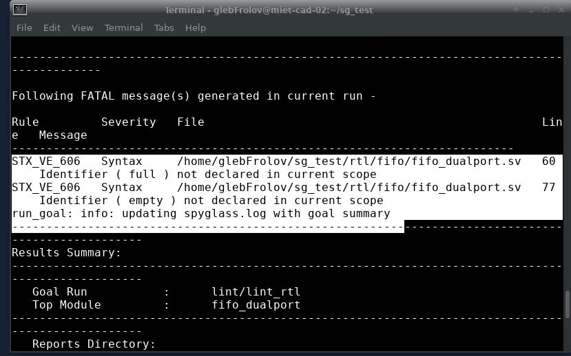

# Отчет по изучению линтера  `Synopsys Spyglass`

первый запуск после редактирования мейкфайла

```makefile
SHELL                   := /bin/bash

## set before use
#export TOP_MODULE=GSIM
export TOP_MODULE=sp_8192x8_nm
export TOP_DIR=$(shell pwd)
export LINT_DIR=$(TOP_DIR)/lint/spyglass

### directories ###
export SOURCE_DIR=$(TOP_DIR)/rtl/test_folde
export ADD_DIR=$(TOP_DIR)/submodules
export SDC_PATH=$(TOP_DIR)/sdc
export RTL_PATH=$(SOURCE_DIR) $(ADD_DIR)
export RTL_SRC=$(wildcard $(shell find $(RTL_PATH) -type f \( -iname \*.h -o -iname \*.vh -o -iname \*.svh -o -iname \*.sv -o -iname \*.v -o -iname \*.vhdl \)))
export INCLUDE_DIRS=$(wildcard $(shell find $(RTL_PATH) -type d -iname \* ))
#export SCRIPTS_DIR=$(TOP_DIR)/spyglass/scripts
export PROJECT_DIR=$(LINT_DIR)/reports/${TOP_MODULE}_WORK
export RTL_TYPE=SIMPLE


.PHONY: lint lint_clean

lint_simple:
	$(LINT_DIR)/run_spyglass.sh simple
lint_full:
	$(LINT_DIR)/run_spyglass.sh full
	@echo "Fatal Error missed  license features: lint_func Auto_Verify dashboard"
lint_clean:
	$(LINT_DIR)/run_spyglass.sh clean
```


## Интересные моменты полученные от линтера

1. первый запуск

и сразу получаю фаталл



```bash
STX_VE_606   Syntax     /home/glebFrolov/sg_test/rtl/fifo/fifo_dualport.sv   60     Identifier ( full ) not declared in current scope
STX_VE_606   Syntax     /home/glebFrolov/sg_test/rtl/fifo/fifo_dualport.sv   77     Identifier ( empty ) not declared in current scope
run_goal: info: updating spyglass.log with goal summary

```


думаю это из-за того, что я объявил после первого использования эти logic

## исправил - теперь все круто


```bash
Goal Violation Summary:
Reported Messages: 0 Fatals, 0 Errors, 0 Warnings, 2 Infos
```


## попробую попросить чат сделать мне сложный модуль и посмотреть какие ошибки мне кинет линтер

`faulty_counter` - тот самый модуль

изначально выглядит вот так:

```sv
module faulty_counter (
    input  logic clk   // ошибка: нет запятой
    input  logic rst_n,
    output logic [7:0] count
);

    logic [7:0] cnt;

    always_ff @ (posedge clk or negedge rst_n) begin
        if (!rst_n) begin
            cnt <= 0 // ошибка: нет точки с запятой
        end else begin
            cnt = cnt + 1; // ошибка: внутри always_ff надо использовать неблокирующие (<=), а не блокирующее (=)
        end
    end

    assign count = cnt  // ошибка: нет точки с запятой и не проверяется переполнение

    // забыли endmodule

```

1. ловим ошибку:

```bash
STX_VE_481   Syntax     /home/glebFrolov/sg_test/rtl/true_error/faulty_counter.sv   3      Syntax error near ( input )
run_goal: info: updating spyglass.log with goal summary
```

> и сразу чиним, добавляя запятую


2. новые проблемы

```bash
STX_VE_573   Syntax     /home/glebFrolov/sg_test/rtl/true_error/faulty_counter.sv   12     Semicolon missing
STX_VE_481   Syntax     /home/glebFrolov/sg_test/submodules/GSIM.v                  2      Syntax error near ( module )
```

> что-то очень страшное, добавив `endmodule` получаем:

```bash
STX_VE_573   Syntax     /home/glebFrolov/sg_test/rtl/true_error/faulty_counter.sv   12     Semicolon missing
STX_VE_481   Syntax     /home/glebFrolov/sg_test/rtl/true_error/faulty_counter.sv   19     Syntax error near ( endmodule )
```


3. добавл `;` появились новые загадки

```bash
Results Summary:
---------------------------------------------------------------------------------------------
   Goal Run           :      lint/lint_rtl
   Command-line read  :      0 error,      0 warning,      0 information message
   Design Read        :      0 error,      1 warning,      2 information messages
      Found 1 top module:
         faulty_counter   (file: /home/glebFrolov/sg_test/rtl/true_error/faulty_counter.sv)

   Blackbox Resolution:      0 error,      0 warning,      0 information message
   SGDC Checks        :      0 error,      0 warning,      0 information message
** Policy lint        :      2 errors,     0 warning,      0 information message
   -------------------------------------------------------------------------------------
   Total              :      2 errors,     1 warning,      2 information messages

  Total Number of Generated Messages     :         5 (2 errors, 1 warning, 2 Infos)
  Number of Reported Messages            :         5 (2 errors, 1 warning, 2 Infos)

  NOTE: It is recommended to first fix/reconcile fatals/errors reported on
        lines starting with ** as subsequent issues might be related to it.
        Please re-run SpyGlass once ** prefixed lines are fatal/error clean.
```
в файле moresimple.rpt было найдено

```bash
[2]      DetectTopDesignUnits    DetectTopDesignUnits    Info                /home/glebFrolov/sg_test/rtl/true_error/faulty_counter.sv                                   1       2       Module faulty_counter is a top level design unit
[0]      SYNTH_77                SYNTH_77                SynthesisWarning    /home/glebFrolov/sg_test/rtl/true_error/faulty_counter.sv                                   11      1000    Both blocking & non-blocking assignments are being done on the variable ( cnt )
[1]      ElabSummary             ElabSummary             Info                ./faulty_counter/faulty_counter/lint/lint_rtl/spyglass_reports/SpyGlass/elab_summary.rpt    0       2       Please refer file './faulty_counter/faulty_counter/lint/lint_rtl/spyglass_reports/SpyGlass/elab_summary.rpt' for elab summary report
```
4. исправляем проблемы с присваиванием и получаем :


>ура
