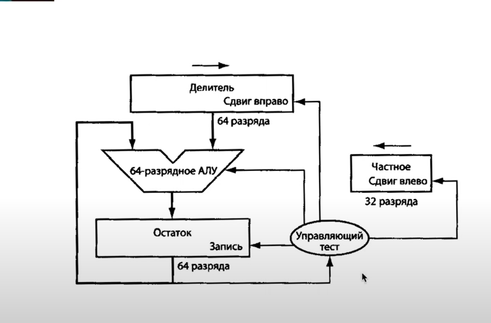
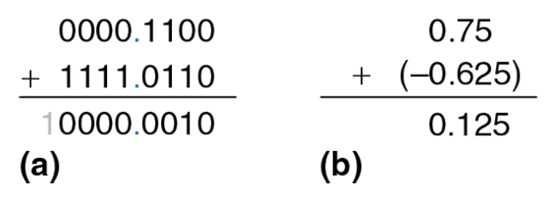
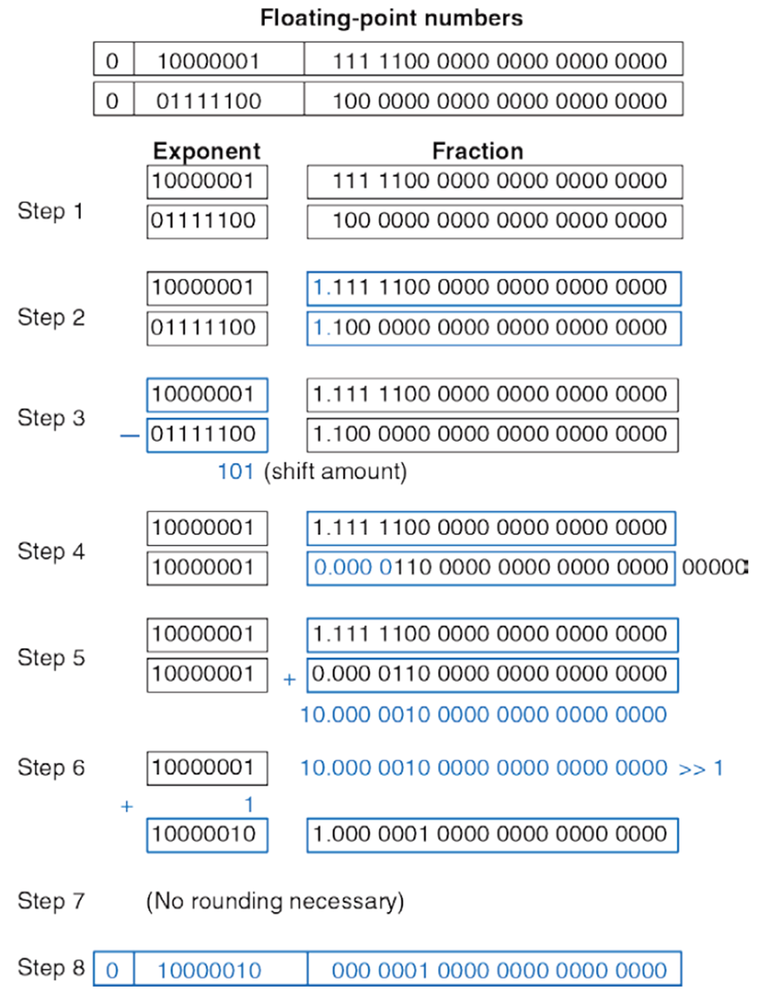

# Fp сумматор находиться в 'source/FPU/FPU_piplined'

# Базовая арифметика и логика


##  вспоминаем

### как задать число в определенной системе счисления в SystemVerilog

* <разрядность> — количество бит (может быть опущено, тогда разрядность определится автоматически).

* <основание> — система счисления:
  1. b или B — двоичная (binary, основание 2)
  2.  o или O — восьмеричная (octal, основание 8)
  3.   или D — десятичная (decimal, основание 10, можно опускать)
  4.    или H — шестнадцатеричная (hexadecimal, основание 16)

* <число> — цифры в указанной системе счисления (допускаются x для неопределенных и z для высокоимпедансных значений).


***  высокоимпедансное состояние (Z) означает, что выход схемы находится в "отключенном" состоянии  ***

---

###  Задание знаковых и беззнаковых чисел в SystemVerilog

```sv
logic signed [7:0] a = 8'shFF;    // Знаковое число (-1 в десятичной)
logic unsigned [7:0] b = 8'hFF;   // Беззнаковое число (255 в десятичной)

```
---
### Операции над двоичными числами: сложение, вычитание, деление, умножение, знаковые и беззнаковые

#### Сложение и вычитание

1. Как происходит сложение чисел в двоичном виде? - побитово с переносом
  ```
      10101011
    + 11111100
      --------
     101010111
  ```
---
2. Что будет, если сложить два беззнаковых числа разной разрядности? (например, 5'd14 + 2'd2). Проверьте на симуляции в Vivado.

    - `5'd14` = `01110`
    - `2'd2` = `10` → **расширяется до 5 бит** (`00010`)
    - Сумма: `01110 + 00010 = 10000` (`5'd16`)
---
3. Что будет, если сложить два беззнаковых числа разной разрядности? (например, 5'd14 + 2'd2). Проверьте на симуляции в Vivado.

   - `5'd20` = `10100`
   - `5'd15` = `01111`
   - Сумма: `10100 + 01111 = `**`1_00011`** (переполнение, 5 бит → `00011` = `3`)
---
4. Как произвести вычитание, не используя знак минуса? Проверьте на симуляции в Vivado

  - **Метод:** `A - B = A + (~B + 1)`
  **Пример (7 - 5):**
  - `5` = `0101` → `~5 + 1` = `1010 + 1` = `1011`
  - `7 + (-5)` = `0111 + 1011` = `1_0010` → `2` (игнорируем переполнение).
---
5. Что будет, если из числа 5'd15 вычесть 5'd18? Проверьте на симуляции в Vivado
    - `5'd15` = `01111`
    - `5'd18` = `10010` → `~18 + 1` = `01101 + 1` = `01110`
    - Сумма: `01111 + 01110` = `11101` → **`29` (но это `-3`)**

  

---
#### Умножение
1. Умножение в двоичной системе
    ```
      101 (5)
    × 011 (3)
    ──────
      101
     101
   +000
    ──────
    1111 (15)
    ```
---
2. Разрядность результата умножения

    - Максимальное 3-битное число: `7` (`111`)
    - Максимальное 5-битное число: `31` (`11111`)
    - Максимальный результат: `7 × 31 = 217` → **8 бит** (`11011001`)
     ```
      logic [7:0] mul1 ,mul2;
      assign mul2 = 3'd7 * 5'd31;

     ```
     
---
3.  Алгоритмы аппаратного умножения

    Аппаратное умножение — это реализация арифметической операции умножения на логических элементах (вентилях, регистрах, сумматорах и т.д.), без использования микрокода или программного ПО.

   1. умножение в столбик. (параллельный)

  

  Мы берём каждый бит множителя и, если он равен 1, прибавляем сдвинутую копию множимого к результату.

  Пример: A = 1011 (11) и B = 1101 (13)

      ```
            1011        <- множимое (A)
          x 1101        <- множитель (B)
      ------------
            1011        <- 1 * A << 0
      +     0000         <- 0 * A << 1
      +   1011           <- 1 * A << 2
      + 1011             <- 1 * A << 3
      ------------
        10001111 (143)
      ```
  1. последовательное умножение

      почти тоже самое что и алгоритм в столбик (параллельный) но уменьшение аппаратуры благодаря использованию одного сумматора
      
---
#### Деление
    Двоичное деление N-разрядных беззнаковых чисел в диапазоне [0, 2N–1]
    может быть выполнено с использованием следующего алгоритма:

    ```
      R' = 0
      for i = N–1 to 0
       R = {R' << 1, Ai}
       D = R – B
       if D < 0 then Qi = 0, R' = R // R < B
       else Qi = 1, R' = D // R ≥ B
      R = R'
    ```

        Частичный остаток R инициализируется 0. Наиболее значимый
    разряд делимого A затем становится наименее значимым разрядом R. Делитель В многократно вычитается из частичного остатка, и определяется
    знак разницы D. Если она отрицательная (т. е. знаковый разряд равен 1),
    то разряд частного Qi равен 0, и разница отбрасывается. В противном
    случае Qi равен 1 и частичный остаток обновляется, он становится равным разнице D. Затем частичный остаток удваивается (сдвигается влево
    на один разряд), и процесс повторяется. Результат удовлетворяет условию A/B = Q + R/B.

    Схема вычисляет A/B и на выход выдает частное Q и остаток R.
    На вставке показаны условные обозначения и схемы каждого блока
    в матрице деления. Сигнал N показывает, является ли результат R – B
    отрицательным. Это определяется по выходному сигналу D самого левого блока в ряду, который является знаком разницы.
    Задержка N-разрядной матрицы деления увеличивается пропорционально N2
    , так как перенос должен пройти через все N каскадов в ряду,
    перед тем как определится знак и мультиплексор выберет R или D. Это
    повторяется для всех N рядов. Деление – очень медленная и дорогая операция в аппаратной реализации, поэтому ее следует использовать как
    можно реже.


  

   - Сколько бит будет результат деления 8-битного числа на 5-битное? Проверьте на симуляции в Vivado от 8 до 4(включая)
    схем

        **последовательное деление**



---

#### Знаковые и беззнаковые числа

  * Прямой код
      Двоичное число, состоящее из N бит и записанное в прямом коде, использует
    наиболее значимый бит для знака, а остальные N – 1 бит для записи
    абсолютного значения этого числа. Если наиболее значимый бит 0, то
    число положительное. Если наиболее значимый бит 1, то число отрицательное.
  * Дополнительный код
      В случае дополнительного кода знак отрицательного
    двоичного числа изменяется на противоположный путем
    выполнения специальной операции, называемой в дополнительном коде (taking the two’s complement). Суть этой
    операции заключается в том, что инвертируются все биты
    этого числа, а затем к значению наименее значимого бита
    прибавляется 1. Подобная операция позволяет найти двоичное представление отрицательного числа или определить его абсолютное значение.

---
### Числа с фиксированной точкой


    ```
    01101100
    0110.1100
    4 + 2 + ½ + ¼ = 6.75
    ```

  ```
  0010.0110 модуль
  1010.0110 прямой код
  1101.1010 дополнительный код
  ```

  

---

### Числа с плавающей точкой

  Числа с плавающей точкой (ieee754)

  1.  Представление числа в нормализованном экспоненциальном виде.
    Возьмем, к примеру, десятичное число 155,625
    Представим это число в нормализованном экспоненциальном виде : 1,55625∙10+2=1,55625∙exp10+2
    Число 1,55625∙exp10+2 состоит из двух частей: мантиссы M=1.55625 и экспоненты exp10=+2
    Если мантисса находится в диапазоне 1<=M<10, то число считается нормализованным.
    Экспонента представлена основанием системы исчисления (в данном случае 10) и порядком (в данном случае +2).
    Порядок экспоненты может иметь отрицательное значение, например число 0,0155625=1,55625∙exp10-2.


   2. Преобразование двоичного нормализованного числа в 32 битный формат IEEE 754

      * Число может быть + или - .
      Поэтому отводится 1 бит для обозначения знака числа:
      0-положительное
      1-отрицательное
      Этот самый старший бит в 32 битной последовательности .
      * Далее пойдут биты экспоненты, для этого выделяют 1 байт (8 бит).
      Экспонента может быть, как и число, со знаком + или -.
      Для определения знака экспоненты, чтобы не вводить ещё один бит знака, добавляют смещение к экспоненте в половину байта +127(0111 1111).
      То есть, если наша экспоната = +7 (+111 в двоичной), то смещенная экспонента = 7+127=134. А если бы, наша экспонента была -7 , то смещенная экспонета=127-7 =120. Смещенную экспоненту записывают в отведенные 8 бит. При этом, когда нам будет нужно получить экспоненту двоичного числа, мы просто отнимем 127 от этого байта.
      * Оставшиеся 23 бита отводят для мантиссы. Но, у нормализованной двоичной мантиссы первый бит всегда равен 1, так как число лежит в диапазоне 1<=M<2. Нет смыла, записывать единицу в отведенные 23 бита, поэтому в отведенные 23 бита записывают остаток от мантиссы.
   3. В таблице представлено десятичное число 155,625 в 32-х битном формате IEEE754:
      |1 бит	|8 бит	    |23 бит	                      |IEEE 754       |
      |-------|-----------|-----------------------------|---------------|
      |0	    |1000 0110	|001 1011 1010 0000 0000 0000	|431BA000 (hex) |
      |0(dec)	|134(dec)	  |1810432(dec)	                |               |

      |Общая длина 𝑛 + 𝑤 + 1, бит   |16   |32  |64  |128|
      |------------------------------|-----|----|----|---|
      |Длина кода знака 𝑠, бит       |1    |1   |1   |1  |
      |Длина кода порядка 𝑤, бит     |5    |8   |11  |15 |
      |Длина кода мантиссы 𝑛, бит    |10   |23  |52  |112|

### Операции над числами с плавающей точкой
  

---

1. умножение
    1. **Сложение экспонент** (с вычетом смещения):

        new_exp = exp_1 + exp_2 - 127


    2. **Умножение мантисс**:
       - Обязательно учитывать скрытые единицы.
       - Результат может содержать 2 бита до точки — требуется нормализация.

    3. **Знак результата**:

        sign_result= sign_1 ^ sign_2


    4. **Формирование итогового числа**.

    5.  Пример: 1.5 × 2.0


    A = 1.5 = 0 01111111 10000000000000000000000
    B = 2.0 = 0 10000000 00000000000000000000000

    Exponent:
    127 + 128 - 127 = 128

    Mantissa:
    1.1 × 1.0 = 1.1

    Итог: 0 10000000 10000000000000000000000 = 3.0
---
2. Деление
    1. **Вычитание экспонент** (с добавлением смещения):


        new_exp = exp_1 - exp_2 + 127


    2. **Деление мантисс**:
       - Учитываем скрытые `1.`.
       - Проверка на нормализацию результата.

    3. **Знак результата**:


        sign_result = sign_1 ^ sign_2


    4. **Формирование итогового значения**.


    5. Пример: 3.0 / 1.5


    A = 3.0 = 0 10000000 10000000000000000000000
    B = 1.5 = 0 01111111 10000000000000000000000

    Exponent:
    128 - 127 + 127 = 128

    Mantissa:
    1.1 / 1.1 = 1.0

    Итог: 0 10000000 00000000000000000000000 = 2.0
---
3. Вычитание

    Вычитание — это частный случай сложения, когда один операнд инвертируется по знаку:


    A - B = A + (-B)


    1.  Этапы:

    * **Инвертируем знак второго числа**.
    * Выполняем сложение по описанному ранее алгоритму.
    * Итог может быть положительным или отрицательным — в зависимости от сравнения значений.

    2. Пример: 1.25 − 0.75


    1.25 = 0 01111111 01000000000000000000000
    0.75 = 0 01111110 10000000000000000000000

    → инвертируем знак второго числа:
    1.25 + (-0.75)

    \= 0.5
    → результат: 0 01111110 00000000000000000000000

---
4. Квадратный корень (sqrt)

    Квадратный корень от числа с плавающей точкой требует:

    1. **Проверки спец. случаев**:
      - √(−x) = **NaN**
      - √(0) = 0
      - √(+∞) = +∞
      - √(NaN) = NaN

    2. **Разделения экспоненты на 2**:
      - Если экспонента нечётная — сначала нормализуем мантиссу:

    3. **Вычисление корня из мантиссы** — обычно через численный метод.
---
5. Операции со специальными значениями

    1. **NaN (Not a Number)**

    > Возникает при:
    - 0 / 0
    - ∞ − ∞
    - √(−x)
    - Инвалидные инструкции

     *  Правила:
        - Любая операция с NaN → **NaN**
        - NaN ≠ NaN (даже с самим собой)

     2. **Infinity (+∞, −∞)**

    > Возникает при:
    - Деление на ноль (x / 0, если x ≠ 0)
    - Переполнение

    * Примеры:
      - 1 / 0 = +∞
      - −1 / 0 = −∞
      - ∞ × 2 = ∞
      - ∞ − ∞ = **NaN**
      - ∞ / ∞ = **NaN**
      - 0 × ∞ = **NaN**

    3. **Ноль (+0, −0)**

    - Есть два нуля: `+0` и `−0`.
    - Используются для точного направления пределов.

    * Примеры:
      - 1 / +0 = +∞
      - 1 / −0 = −∞
      - −0 + 0 = 0 (или +0 — в зависимости от реализации)
      - √(−0) = −0

    4. **Denormalized numbers**

    > Числа, у которых экспонента = 0 и нет скрытого бита `1.`
    Используются для представления **очень малых значений**, близких к 0.

    5. Таблица спец. случаев

    | Операция      | Результат |
    |---------------|-----------|
    | `NaN + x`     | `NaN`     |
    | `Inf + Inf`   | `Inf`     |
    | `Inf - Inf`   | `NaN`     |
    | `1 / 0.0`     | `Inf`     |
    | `-1 / 0.0`    | `-Inf`    |
    | `0 / 0`       | `NaN`     |
    | `Inf * 0`     | `NaN`     |
    | `sqrt(−4)`    | `NaN`     |
    | `sqrt(+0)`    | `+0`      |
    | `sqrt(−0)`    | `−0`      |

    ---


### Базовые логические операции: не, и, или, xor и их комбинации (NOR-NAND), таблицы истинности

#### основные логические операции

1. НЕ (NOT)

- Обозначение: `¬A` или `~A`
- Описание: Инвертирует логическое значение.
- Таблица истинности:

| A | ¬A |
|---|----|
| 0 | 1  |
| 1 | 0  |

---

1. И (AND)

- Обозначение: `A ∧ B` или `A & B`
- Описание: Истина, если оба операнда равны 1.
- Таблица истинности:

| A | B | A ∧ B |
|---|---|--------|
| 0 | 0 |   0    |
| 0 | 1 |   0    |
| 1 | 0 |   0    |
| 1 | 1 |   1    |

---

1. ИЛИ (OR)

- Обозначение: `A ∨ B` или `A | B`
- Описание: Истина, если хотя бы один из операндов равен 1.
- Таблица истинности:

| A | B | A ∨ B |
|---|---|--------|
| 0 | 0 |   0    |
| 0 | 1 |   1    |
| 1 | 0 |   1    |
| 1 | 1 |   1    |

---

1. Исключающее ИЛИ (XOR)

- Обозначение: `A ⊕ B` или `A ^ B`
- Описание: Истина, если операнды различны.
- Таблица истинности:

| A | B | A ⊕ B |
|---|---|--------|
| 0 | 0 |   0    |
| 0 | 1 |   1    |
| 1 | 0 |   1    |
| 1 | 1 |   0    |

---

#### Комбинированные логические операции

1. NAND (НЕ-И)

- Обозначение: `¬(A ∧ B)`
- Описание: Инверсия операции AND.
- Таблица истинности:

| A | B | A ∧ B | NAND |
|---|---|--------|------|
| 0 | 0 |   0    |  1   |
| 0 | 1 |   0    |  1   |
| 1 | 0 |   0    |  1   |
| 1 | 1 |   1    |  0   |

---

1. NOR (НЕ-ИЛИ)

- Обозначение: `¬(A ∨ B)`
- Описание: Инверсия операции OR.
- Таблица истинности:

| A | B | A ∨ B | NOR |
|---|---|--------|-----|
| 0 | 0 |   0    |  1  |
| 0 | 1 |   1    |  0  |
| 1 | 0 |   1    |  0  |
| 1 | 1 |   1    |  0  |

---


### Триггеры и регистры, принцип работы

Триггеры и регистры — это основные элементы хранения информации в цифровых схемах. Они используются в микропроцессорах, микроконтроллерах, и других цифровых устройствах для хранения и передачи данных.

---

#### Что такое триггер?

>Триггер — это простейшее запоминающее устройство, способное хранить один бит информации (`0` или `1`). Он имеет два устойчивых состояния и изменяет своё состояние под действием управляющих сигналов.

---

  1. Основные типы триггеров:

      | Тип триггера | Входы                     | Назначение                                              |
      |--------------|---------------------------|---------------------------------------------------------|
      | RS (SR)      | S (установить), R (сброс) | Простой триггер на основе логики ИЛИ-НЕ                 |
      | JK           | J, K                      | Расширение RS-триггера, устраняет запрещённое состояние |
      | D            | D (данные)                | Запоминает входное значение на фронте тактового сигнала |
      | T            | T (тоггл)                 | Меняет состояние при каждом тактовом импульсе           |


  1. RS-триггер:

      | S | R | Q (следующее состояние) | Примечание           |
      |---|---|--------------------------|-----------------------|
      | 0 | 0 | Q (не меняется)          | Хранение состояния    |
      | 0 | 1 | 0                        | Сброс                 |
      | 1 | 0 | 1                        | Установка             |
      | 1 | 1 | ? (недопустимо)          | Запрещённое состояние |

  1. D-триггер:

     | D | CLK ↑ | Q (следующее состояние) |
     |---|--------|--------------------------|
     | 0 |   ↑    | 0                        |
     | 1 |   ↑    | 1                        |

> D-триггер часто используется в регистрах, поскольку его поведение предсказуемо: выход равен входу при приходе тактового сигнала.


#### Что такое регистр?

  >Регистр — это группа триггеров, объединённых для хранения многобитного двоичного числа (например, 8, 16, 32, 64 бита).

---

  1. Основные типы регистров:

  | Тип регистра                    | Назначение                                       |
  |---------------------------------|--------------------------------------------------|
  | Параллельной загрузки           | Одновременно принимает все биты данных           |
  | Сдвиговый регистр               | Перемещает биты влево или вправо                 |
  | Счётчик                         | Последовательно увеличивает или уменьшает число  |
  | Регистр сдвига с вводом-выводом | Для сериализации/десериализации данных           |


  1. Принцип работы регистра

  - Каждый бит данных сохраняется в отдельном D-триггере.
  - На вход подаются данные и тактовый сигнал.
  - На фронте тактового сигнала данные фиксируются в триггерах.
  - Выходы триггеров формируют слово (набор битов), которое сохраняется до следующего обновления.

  1. Пример: 4-битный параллельный регистр

  - Состоит из 4 D-триггеров.
  - Каждый триггер хранит один бит (D0, D1, D2, D3).
  - Все триггеры получают один общий тактовый сигнал.
  - При подаче тактового импульса значения на входах D сохраняются во внутреннем состоянии Q.


### Таблица истинности LUT, защелки, триггеры, регистры, сдвиговые регистры

  1. Таблица истинности

  >Таблица истинности описывает поведение логической функции на всех возможных комбинациях входов.

  Пример: A AND B

  | A | B | A ∧ B |
  |---|---|--------|
  | 0 | 0 |   0    |
  | 0 | 1 |   0    |
  | 1 | 0 |   0    |
  | 1 | 1 |   1    |


  2. LUT (Look-Up Table)

  **LUT (таблица соответствий)** — элемент, используемый в ПЛИС (FPGA) для реализации логических функций.

  - LUT хранит таблицу истинности внутри памяти.
  - На вход подаются биты, LUT возвращает соответствующее значение.
  - Пример: LUT на 3 входа может описать любую функцию из 3 переменных (всего 8 строк таблицы).

    Пример LUT-таблицы на 2 входа:

  | A | B | F(A,B) |
  |---|---|--------|
  | 0 | 0 |   1    |
  | 0 | 1 |   0    |
  | 1 | 0 |   1    |
  | 1 | 1 |   1    |


  3. Защёлки (Latches)

  Защёлка — это элемент памяти, хранящий 1 бит. В отличие от триггера, она **асинхронная** — реагирует на уровень сигнала, а не на фронт.

  4. D-защёлка (D-latch)

  | Enable | D | Q (на выходе) |
  |--------|---|----------------|
  |   0    | X | удерживает     |
  |   1    | 0 | 0              |
  |   1    | 1 | 1              |

  - Пока `Enable = 1`, выход Q повторяет вход D.
  - Когда `Enable = 0`, защёлка сохраняет последнее значение.

---


### Конечные автоматы: Мили и Мур, Графы конечных автоматов

1. Автомат Мили (Mealy FSM)

  - **Выходы зависят от текущего состояния и входа.**
  - Более **реактивный**, часто реагирует на вход сразу.
  - Используется, когда выход должен быстро меняться в ответ на изменение входа.
2. Автомат Мура (Moore FSM)
  - **Выходы зависят только от состояния.**
  - Более **предсказуемый**, так как выходы не скачут из-за входов.
  - Удобен для синхронных схем.
 Графы конечных автоматов

3. FSM можно визуализировать с помощью **графов состояний**, где:

  - **Вершины** — состояния (`S0`, `S1`, ...).
  - **Рёбра** — переходы между состояниями по входным условиям.
  - Подписанные метки показывают переходы и/или выходные сигналы.

4. Описание конечного автомата (FSM)

  Для описания конечного автомата используется следующая схема (в интернете она ходит под названием FSM 3 process):

  ```sv
  reg [1:0] state;
  reg [1:0] next_state;

  localparam IDLE_S = 2'b00;
  localparam RUN_S  = 2'b01;
  localparam WAIT_s = 2'b10;

  always @( posedge clk_i or posedge rst_i )
    if( rst_i )
      state <= IDLE_S;
    else
      state <= next_state;

  always @( * )
    begin
      next_state = state;

      case( state )
        IDLE_S:
          begin
            if( ... )
              next_state = RUN_S;
          end

        RUN_S:
          begin
            if( ... )
              next_state = WAIT_S;
            else
              if( )
                next_state = IDLE_S;
          end

        WAIT_S:
          begin
            if( ... )
              next_state = RUN_S;
          end

        default:
          begin
            next_state = IDLE_S;
          end

      endcase
    end

  // some logic, that generates output values on state and next_state signals
  ```
Пояснение:

  * state обозначает текущее состояние, next_state - то, которое будет в state на следующем такте.
  * IDLE_S - дефолтное состояние, поэтому его устанавливают во время асинхронного сброса и default в case-блоке. Для удобства считаем, что это состояние должно идти первым в списке parameter.
  * Имена состояний FSM описываются большими буквами и должны содержать суффикс _S (IDLE_S, TX_S, WAIT_S и т.д.).

Категорически запрещается:

* в блоке, где происходит назначение на next_state делать назначение еще каких-либо сигналов
* производить какие-либо другие операции, кроме операции сравнения (==, !=) с переменными state, next_state, например:

  ```sv
  assign b = ( state > RED_S );
  assign c = ( state + 3'd2 ) > ( IDLE_S );
  ```
