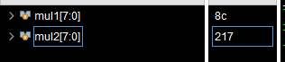

# Базовая арифметика и логика


##  вспоминаем

### как задать число в определенной системе счисления в SystemVerilog

* <разрядность> — количество бит (может быть опущено, тогда разрядность определится автоматически).

* <основание> — система счисления:
  1. b или B — двоичная (binary, основание 2)
  2.  o или O — восьмеричная (octal, основание 8)
  3.   или D — десятичная (decimal, основание 10, можно опускать)
  4.    или H — шестнадцатеричная (hexadecimal, основание 16)

* <число> — цифры в указанной системе счисления (допускаются x для неопределенных и z для высокоимпедансных значений).


***  высокоимпедансное состояние (Z) означает, что выход схемы находится в "отключенном" состоянии  ***

###  Задание знаковых и беззнаковых чисел в SystemVerilog

```sv
logic signed [7:0] a = 8'shFF;    // Знаковое число (-1 в десятичной)
logic unsigned [7:0] b = 8'hFF;   // Беззнаковое число (255 в десятичной)

```

### Операции над двоичными числами: сложение, вычитание, деление, умножение, знаковые и беззнаковые

#### Сложение и вычитание

1. Как происходит сложение чисел в двоичном виде? - побитово с переносом
  ```
      10101011
    + 11111100
      --------
     101010111
  ```

2. Что будет, если сложить два беззнаковых числа разной разрядности? (например, 5'd14 + 2'd2). Проверьте на симуляции в Vivado.

    - `5'd14` = `01110`
    - `2'd2` = `10` → **расширяется до 5 бит** (`00010`)
    - Сумма: `01110 + 00010 = 10000` (`5'd16`)

3. Что будет, если сложить два беззнаковых числа разной разрядности? (например, 5'd14 + 2'd2). Проверьте на симуляции в Vivado.

   - `5'd20` = `10100`
   - `5'd15` = `01111`
   - Сумма: `10100 + 01111 = `**`1_00011`** (переполнение, 5 бит → `00011` = `3`)

4. Как произвести вычитание, не используя знак минуса? Проверьте на симуляции в Vivado

  - **Метод:** `A - B = A + (~B + 1)`
  **Пример (7 - 5):**
  - `5` = `0101` → `~5 + 1` = `1010 + 1` = `1011`
  - `7 + (-5)` = `0111 + 1011` = `1_0010` → `2` (игнорируем переполнение).

5. Что будет, если из числа 5'd15 вычесть 5'd18? Проверьте на симуляции в Vivado
    - `5'd15` = `01111`
    - `5'd18` = `10010` → `~18 + 1` = `01101 + 1` = `01110`
    - Сумма: `01111 + 01110` = `11101` → **`29` (но это `-3`)**

  

---
#### Умножение
1. Умножение в двоичной системе
    ```
      101 (5)
    × 011 (3)
    ──────
      101
     101
   +000
    ──────
    1111 (15)
    ```

2. Разрядность результата умножения

    - Максимальное 3-битное число: `7` (`111`)
    - Максимальное 5-битное число: `31` (`11111`)
    - Максимальный результат: `7 × 31 = 217` → **8 бит** (`11011001`)
     ```
      logic [7:0] mul1 ,mul2;
      assign mul2 = 3'd7 * 5'd31;

     ```
     
3.  Алгоритмы аппаратного умножения

    Аппаратное умножение — это реализация арифметической операции умножения на логических элементах (вентилях, регистрах, сумматорах и т.д.), без использования микрокода или программного ПО.

   1. умножение в столбик. (параллельный)

  

  Мы берём каждый бит множителя и, если он равен 1, прибавляем сдвинутую копию множимого к результату.

  Пример: A = 1011 (11) и B = 1101 (13)

      ```
            1011        <- множимое (A)
          x 1101        <- множитель (B)
      ------------
            1011        <- 1 * A << 0
      +     0000         <- 0 * A << 1
      +   1011           <- 1 * A << 2
      + 1011             <- 1 * A << 3
      ------------
        10001111 (143)
      ```
  1. последовательное умножение

      почти тоже самое что и алгоритм в столбик (параллельный) но уменьшение аппаратуры благодаря использованию одного сумматора
      
1. Деление
    Двоичное деление N-разрядных беззнаковых чисел в диапазоне [0, 2N–1]
    может быть выполнено с использованием следующего алгоритма:
    ```
      R' = 0
      for i = N–1 to 0
       R = {R' << 1, Ai}
       D = R – B
       if D < 0 then Qi = 0, R' = R // R < B
       else Qi = 1, R' = D // R ≥ B
      R = R'
    ```

        Частичный остаток R инициализируется 0. Наиболее значимый
    разряд делимого A затем становится наименее значимым разрядом R. Делитель В многократно вычитается из частичного остатка, и определяется
    знак разницы D. Если она отрицательная (т. е. знаковый разряд равен 1),
    то разряд частного Qi равен 0, и разница отбрасывается. В противном
    случае Qi равен 1 и частичный остаток обновляется, он становится равным разнице D. Затем частичный остаток удваивается (сдвигается влево
    на один разряд), и процесс повторяется. Результат удовлетворяет условию A/B = Q + R/B.

    Схема вычисляет A/B и на выход выдает частное Q и остаток R.
    На вставке показаны условные обозначения и схемы каждого блока
    в матрице деления. Сигнал N показывает, является ли результат R – B
    отрицательным. Это определяется по выходному сигналу D самого левого блока в ряду, который является знаком разницы.
    Задержка N-разрядной матрицы деления увеличивается пропорционально N2
    , так как перенос должен пройти через все N каскадов в ряду,
    перед тем как определится знак и мультиплексор выберет R или D. Это
    повторяется для всех N рядов. Деление – очень медленная и дорогая операция в аппаратной реализации, поэтому ее следует использовать как
    можно реже.


