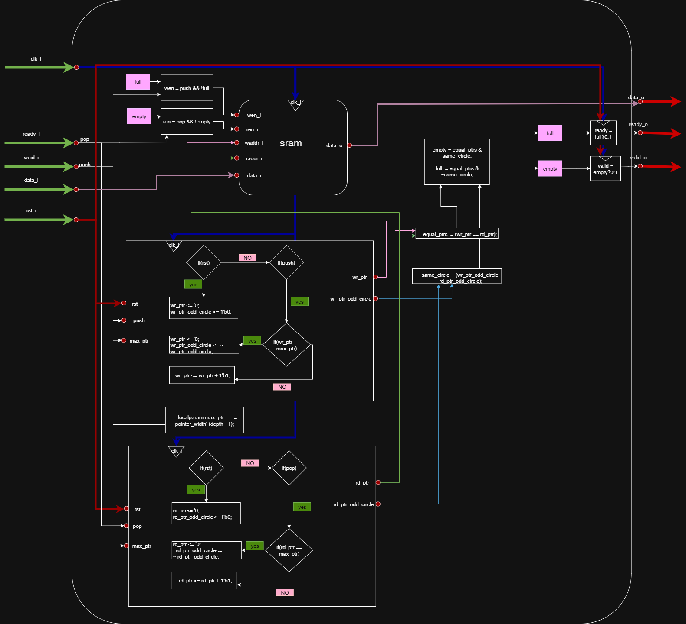

# Show-ahead  FIFO на simple dual-port sram

я попробую реализовать пример памяти данный в 14 занятии цифровой школы синтеза


**схема моей реализаци FIFO**




# FIFO с двусторонним интерфейсом

Модуль `fifo_dualport` реализует параметризованную синхронную очередь FIFO (first-in, first-out) с интерфейсом «ready/valid». Запись и чтение данных происходят по кольцевому буферу с фиксированным размером. Такой буфер «использует один фиксированный буфер как будто он замкнут в кольцо, что подходит для буферизации потоков данных» и обеспечивает порядок FIFO (первым пришёл – первым вышел).

## Описание модуля

```verilog
module fifo_dualport #(
  parameter WIDTH  = 8,
  parameter DEPTH  = 8
)(
  input  logic              clk_i,
  input  logic              rst_i,
  input  logic              valid_i,
  input  logic              ready_i,
  input  logic [WIDTH-1:0]  data_i,
  output logic [WIDTH-1:0]  data_o,
  output logic              ready_o,
  output logic              valid_o
);
endmodule
```

**Входные данные:** Сигналы на входе модуля:

* `clk_i` – тактовый сигнал.
* `rst_i` – сигнал синхронного сброса (активен при `1`), сбрасывающий указатели и флаги.
* `valid_i` – сигнал валидности входных данных .
* `ready_i` – сигнал готовности чтения (потребитель указывает готовность принять данные из FIFO).
* `data_i` – входные данные (WIDTH бит), передаваемые при `valid_i = 1`.

**Выходные данные:** Сигналы на выходе модуля:

* `data_o` – выходные данные (WIDTH бит), считываемые из FIFO.
* `ready_o` – сигнал готовности FIFO принять новые данные (устанавливается в `1`, когда FIFO **не полон**).
* `valid_o` – сигнал валидности выходных данных (устанавливается в `1`, когда FIFO **не пуст**).

**Параметры и внутренние переменные:**

* `WIDTH` – ширина шины данных.
* `DEPTH` – глубина FIFO (максимальное число элементов).
* `pointer_width` – локальный параметр - ширина указателей.
* `max_ptr` – локальный параметр, равный `DEPTH - 1`.
* `wr_ptr`, `rd_ptr` – регистры указателей записи (write) и чтения (read).
* `wr_circle_odd`, `rd_circle_odd` – флаги циклического сброса указателей (инвертируются при достижении конца буфера).
* `equal_ptrs`, `same_circle` – вспомогательные сигналы для сравнения указателей и флагов.
* `empty`, `full` – признаки пустого и полного состояния FIFO.
* `wen` (write enable), `ren` (read enable) – сигналы разрешения записи и чтения в SRAM (`wen = valid_i & !full`, `ren = ready_i & !empty`).
* `sram_out` – выход данных из SRAM.

## Принцип работы

FIFO использует handshake-интерфейс «ready/valid»: передача данных по шине `data_i`/`data_o`. Со стороны производителя (`valid_i`) данные ставятся на вход, а FIFO сообщает о готовности принять их через `ready_o`. Со стороны потребителя (`ready_i`) FIFO выводит данные и выставляет `valid_o`, когда данные готовы к чтению (но придется подождать два такта в дело вступил Костыль Костылыч).

* При активном `rst_i = 1` указатели `wr_ptr` и `rd_ptr` сбрасываются в `0`, флаги `wr_circle_odd` и `rd_circle_odd` обнуляются, и очередь считается пустой. После выхода из сброса (`rst_i = 0`) сигналы `ready_o` и `valid_o` устанавливаются в соответствии с состоянием (FIFO пуст: `valid_o = 0`, `ready_o = 1`).
* Если `valid_i = 1` и FIFO **не полон** (`full = 0`), то на следующем фронте `clk_i` данные `data_i` записываются в память (SRAM) по адресу `wr_ptr`. Затем `wr_ptr` увеличивается на 1. При достижении `wr_ptr == max_ptr` счётчик `wr_ptr` сбрасывается в `0`, а флаг `wr_circle_odd` инвертируется (указатель «обходит» буфер).
* Если `ready_i = 1` и FIFO **не пуст** (`empty = 0`), то на следующем фронте `clk_i` данные по адресу `rd_ptr` считываются из памяти и появляются на `data_o`. Затем `rd_ptr` инкрементируется. При достижении `rd_ptr == max_ptr` счётчик `rd_ptr` сбрасывается в `0`, а флаг `rd_circle_odd` инвертируется.

Состояние FIFO определяется по указателям и флагам «круга». Если указатели `wr_ptr` и `rd_ptr` равны, то:

* Если флаги `wr_circle_odd` и `rd_circle_odd` совпадают, FIFO **пуст** (`empty = 1`).
* Если флаги различаются, FIFO **полон** (`full = 1`), и на `ready_o` устанавливается `0`.

Сигналы `wen = valid_i & !full` и `ren = ready_i & !empty` управляют операциями записи/чтения памяти SRAM. Сигналы `ready_o` и `valid_o` выставляются соответственно: `ready_o = 1`, когда FIFO **не полон**, и `valid_o = 1`, когда FIFO **не пуст**. Передача данных фактически происходит только при одновременном `valid_i=1` и `ready_o=1` (запись) или `valid_o=1` и `ready_i=1` (чтение).


## Пример работы (тестирование)

В тестбенче `tb_fifo_dualport` проверяются типичные сценарии:

* **Простой push/pop:** Запись одного значения и последующее чтение. Проверяется, что возвращаемое значение совпадает с записанным (FIFO следует принципу «первым пришёл – первым вышел»).
* **Заполнение до полного:** Последовательные операции записи до достижения глубины `DEPTH`. Ожидается, что после заполнения `ready_o` станет `0` и новые данные не будут приниматься. Попытка записать дополнительный элемент не должна изменить состояние FIFO.
* **Опустошение FIFO:** Последовательное чтение всех элементов до опустошения очереди. Проверяется, что данные читаются в том же порядке, в котором записывались. После опустошения FIFO сигнал `valid_o` должен стать `0`.
* **Работа после сброса:** После установки `rst_i=1` и возврата в `0` указатели обнуляются, и FIFO переходит в пустое состояние.
