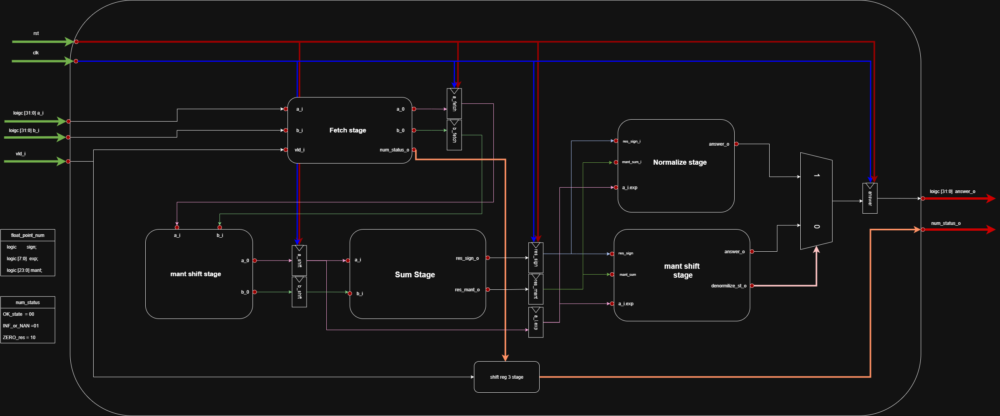
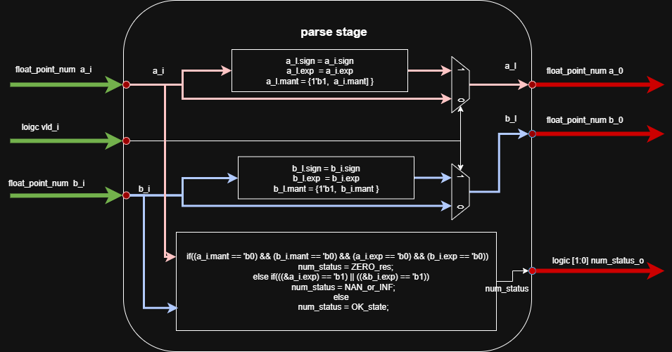
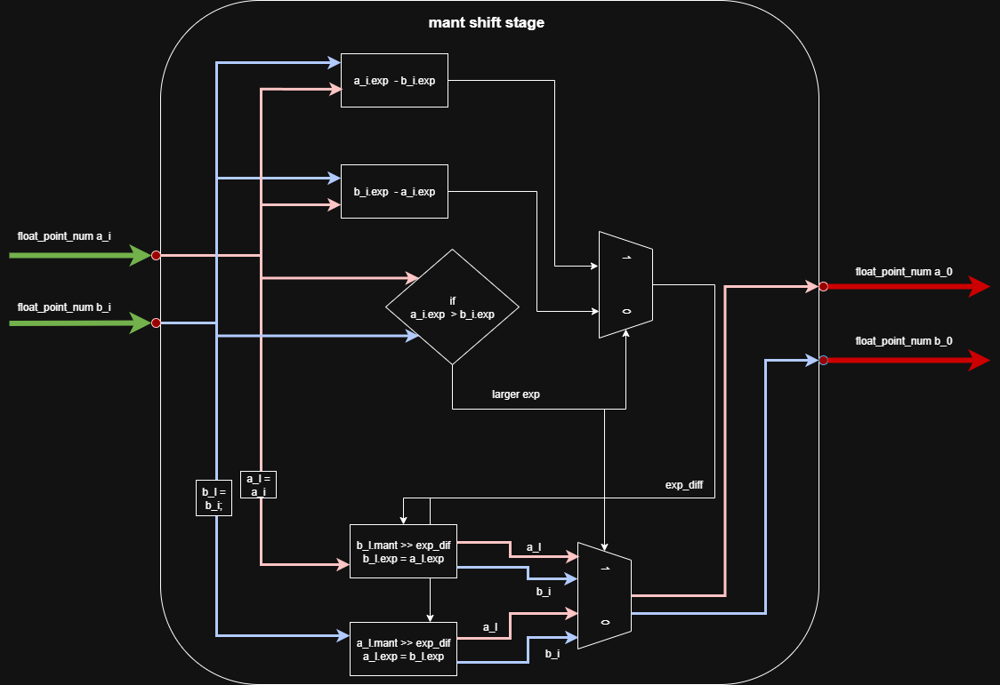
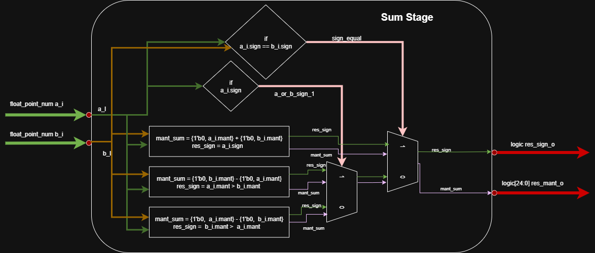
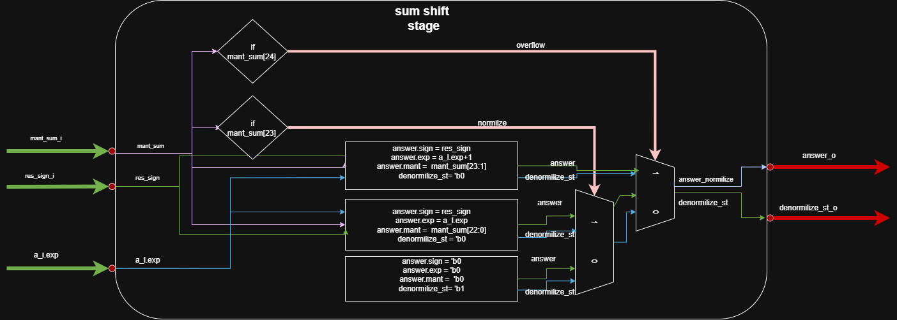
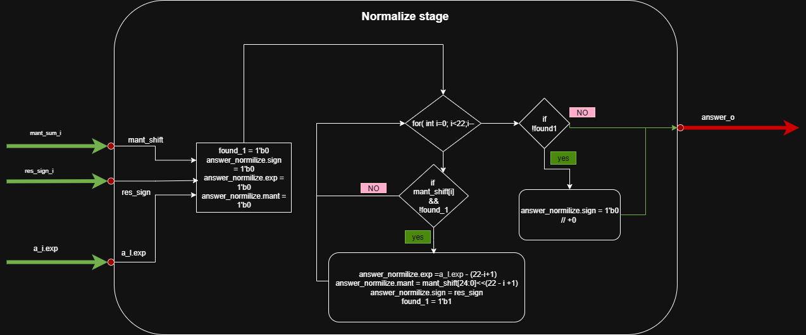

# Pipilined сумматор чисел с плавающей точкой
  Данный модуль реализует конвейерный (pipeline) сумматор чисел в формате IEEE-754 одинарной точности. Операнды и результат представлены структурой float_point_num (из float_types_pkg) с полями: знак (1 бит), порядок (8 бит) и мантисса (24 бита, включая неявный ведущий 1). Процесс сложения разбит на несколько стадий: выравнивание порядков, суммирование мантисс и нормализация результата. В первой стадии (fetch_stage) неявный бит «1» явным образом добавляется к мантиссе каждого входного числа (если сигнал valid_i активен). Кроме того, на этой стадии определяется статус операции: если оба входа нулевые, выставляется код ZERO_res; если хотя бы одна экспонента равна «11111111», – INF_OR_NAN; иначе – OK_state.

## Описание главного модуля pipelined_fp_summator

  ```sv
    module pipelined_fp_summator import float_types_pkg::*;
  input  logic           clk_i,
  input  logic           rst_i,
  input  float_point_num a_i,
  input  float_point_num b_i,
  input  logic           vld_i,
  output float_point_num answer_o,
  output logic [1:0]     num_status_o
  );
  endmodule
  ```
  * **Входные данные**:

  * `clk_i` – тактовый сигнал конвейера.
  * `rst_i` – асинхронный сброс.
  * `a_i`, `b_i` – входные числа (тип `float_point_num`).
  * `vld_i` – сигнал валидности входных данных (по нему «включается» конвейер).
* **Выходные данные**:

  * `answer_o` – итоговая сумма (тип `float_point_num`).
  * `num_status_o` – 2‑битный код состояния результата.

  *Комментарий:* Этот модуль объединяет описанные стадии в конвейере. Входные данные проходят последовательно через `fetch_stage`, `mant_shif_stage`, `sum_stage`, `sum_shift_stage` и `normilize_stage`. Между ними используются регистры (`always_ff`) для сохранения промежуточных значений (`a_fetch, b_fetch, a_shift, b_shift, res_mant, res_sign, a_i_exp` и др.) на каждом такте. Специальный сдвиговый регистр `shift_reg` задерживает код `status_o` на 4 такта (`STAGES=4`), чтобы он синхронизировался с финальным результатом. В результате `answer_o` становится доступен через несколько тактов после установки `vld_i=1` (начальная задержка конвейера – 4 такта), после чего каждое тактовое событие выдаёт новый результат (пропускная способность 1 операнд/такте). Перечисленные стадии отражают классический алгоритм сложения FP: выравнивание порядков, суммирование мантисс и нормализацию. Модуль автоматически обрабатывает специальные случаи (нулевой и инфинитный вход) за счёт предварительного анализа в `fetch_stage` и соответствующего выставления `num_status_o`.


  

  [ссылка в drawio](https://viewer.diagrams.net/?tags=%7B%7D&lightbox=1&highlight=0000ff&edit=_blank&layers=1&nav=1&dark=auto#G1UwXYbsoideV5SjgzxZCcaHAG7pmcTvvp)


## Описание модуля parse_stage


  ```sv
  module fetch_stage import float_types_pkg.*;
  input  logic           valid_i,
  input  float_point_num a_i,
  input  float_point_num b_i,
  output float_point_num a_o,
  output float_point_num b_o,
  output logic [1:0]     num_status
  );
  endmodule
  ```

* **Входные данные**:

  * `valid_i` – сигнал разрешения работы стадии (при `1` выполняется нормализация мантисс; при `0` входы передаются без изменений).
  * `a_i`, `b_i` – входные числа в формате `float_point_num`.

* **Выходные данные**:

  * `a_o`, `b_o` – выходные представления операндов. Если `valid_i=1`, к 23‑битной мантиссе каждого операнда добавляется неявный бит «1» (формируется 24‑битная мантисса); иначе операнды выходят без изменений.
  * `num_status` – 2‑битный код состояния числа (`OK_state`=00, `INF_OR_NAN`=01, `ZERO_res`=10). Устанавливается в зависимости от особых случаев входов: нулевые мантиссы и порядки дают `ZERO_res`; все единицы в поле порядка дают `INF_OR_NAN`; иначе – `OK_state`.

*Комментарий:* при активном `valid_i` стадия добавляет ведущий «1» к мантиссе (так как в нормализованном IEEE-754 формате мантисса записывается без ведущей единицы). Проверка особых случаев (ноль, бесконечность/NaN) производится до сложения.

 

  [ссылка в drawio](https://viewer.diagrams.net/?tags=%7B%7D&lightbox=1&highlight=0000ff&edit=_blank&layers=1&nav=1&dark=auto#G1S2nMKdY1hsTfB1ZZuwkGL4u54-6SlDVt)


## Описание модуля Описание модуля mant_shif_stage

  ```sv
  module mant_shif_stage import float_types_pkg.*;
    input  float_point_num a_i,
    input  float_point_num b_i,
    output float_point_num a_o,
    output float_point_num b_o
  );
  endmodule
  ```

* **Входные данные**:

  * `a_i`, `b_i` – входные числа.
* **Выходные данные**:

  * `a_o`, `b_o` – числа после выравнивания порядков.

*Комментарий:* Эта стадия выравнивает мантиссы входных чисел по одному порядку. Сначала вычисляется, у какого операнда порядок больше: если `exp_a > exp_b`, то полю `b` присваивается больший порядок `exp_a`, а его мантисса `mant_b` сдвигается вправо на разность порядков; иначе аналогично для `a`. Таким образом на выходе оба числа имеют одинаковый порядок, а мантисса меньшего из них выровнена по битам старшего.



[ссылка в drawio](https://viewer.diagrams.net/?tags=%7B%7D&lightbox=1&highlight=0000ff&edit=_blank&layers=1&nav=1&dark=auto#G1FB_OMjwa9uwDb7vLqLOIjS0Do-0mhWfe)


## Описание модуля sum_stage

  ```sv
  module sum_stage import float_types_pkg.*;
    input  float_point_num a_i,
    input  float_point_num b_i,
    output logic [24:0] res_mant_o,
    output logic           res_sign_o
  );
  endmodule
  ```

  * **Входные данные**:

    * `a_i`, `b_i` – выровненные по порядку числа.
  * **Выходные данные**:

    * `res_mant_o` – 25‑битная частичная сумма мантисс .
    * `res_sign_o` – знак результата сложения.

  *Комментарий:* На этой стадии происходит собственно сложение или вычитание мантисс. Если знаки `a_i.sign` и `b_i.sign` одинаковы, модули добавляют мантиссы `{1’b0, mant}` и передают общий знак. Если знаки различаются, из большей мантиссы вычитается меньшая, а знак результата берётся от большего по модулю слагаемого. Итоговая мантисса (`res_mant_o`) представляет собой ненормализованный результат (сдвигов пока не делали), а `res_sign_o` – знак суммы.


  

   [ссылка в drawio](https://viewer.diagrams.net/?tags=%7B%7D&lightbox=1&highlight=0000ff&edit=_blank&layers=1&nav=1&dark=auto#G14xYWnAPind7sDLxQ1G1yu5tdPV9t97AP)


## sum_shift_stage

  ``` sv
  module sum_shift_stage import float_types_pkg.*;
    input  logic [24:0] res_mant_i,
    input  logic        res_sign_i,
    input  logic [7:0]  a_i_exp,
    output float_point_num answer_o,
    output logic        denormilize_state_o
  );
  endmodule
  ```

  * **Входные данные**:

    * `res_mant_i` – 25‑битная результирующая мантисса из предыдущей стадии.
    * `res_sign_i` – её знак.
    * `a_i_exp` – предварительный порядок (экспонента) результата (обычно равен порядку большего операнда).
  * **Выходные данные**:

    * `answer_o` – промежуточный результат в формате `float_point_num`.
    * `denormilize_state_o` – флаг «требуется нормализация».

  *Комментарий:* Эта стадия выполняет **первичную нормализацию** суммы. Если при сложении возник перенос (старший бит `res_mant_i[24] == 1`), мантисса сдвигается вправо на 1 и экспонента увеличивается (`exp = a_i_exp + 1`); если же старший бит ненулевой (`res_mant_i[23] == 1`), результат уже нормализован и сохраняется текущий порядок (`exp = a_i_exp`). В этих случаях флаг `denormilize_state_o` остаётся `0` (нормализованный результат) и `answer_o` формируется с учётом знака и новых полей. Если же оба старших бита (`[24]` и `[23]`) нули, результат оказывается денормализованным: устанавливается `denormilize_state_o=1`, а окончательная нормализация отложена в следующую стадию (она идет параллельно этой стадии, но благодаря вставленному биту в `denormilize_state_o=1`, потом выбирается ответ между этими двумя блоками). Таким образом, `sum_shift_stage` отвечает за корректировку порядка при переносе и идентификацию случаев денормализации.


  


[ссылка в drawio](https://viewer.diagrams.net/?tags=%7B%7D&lightbox=1&highlight=0000ff&edit=_blank&layers=1&nav=1&dark=auto#G1hx4p0rY0Umkv4bjSCuyPX-gVh7J3PmBa)


## Описание модуля normilize\_stage

  ```sv
  module normilize_stage import float_types_pkg.*;
    input  logic [24:0] res_mant_i,
    input  logic        res_sign_i,
    input  logic [7:0]  a_i_exp,
    output float_point_num answer_o
  );
  endmodule
  ```

  * **Входные данные**:

    * `res_mant_i`, `res_sign_i`, `a_i_exp` – те же сигналы, что на входе `sum_shift_stage`.
  * **Выходные данные**:

    * `answer_o` – окончательный результат сложения (после нормализации) в формате `float_point_num`.

  *Комментарий:* "Эта стадия последовательно ищет первый старший единичный бит в `res_mant_i` и сдвигает мантиссу влево, уменьшая экспоненту, чтобы восстановить нормализованный вид. Например, если после сложения вес мантиссы оказался меньше `[23]`‑го бита, первый единичный бит может оказаться на позиции `i<23`, и `normilize_stage` сдвинет мантиссу на `22-i` разрядов влево, уменьшив `exp = a_i_exp - (22-i+1)`. После этого выход `answer_o` получает скорректированные поля `exp` и `mant`. Если единичных битов не найдено (сумма = 0), то формируется нулевой результат. Иными словами, эта стадия выполняет полную нормализацию для «сдвинутых» результатов. В иных случаях (когда `denormilize_state_o=0`), её результат не используется.



[ссылка в drawio](https://viewer.diagrams.net/?tags=%7B%7D&lightbox=1&highlight=0000ff&edit=_blank&layers=1&nav=1&dark=auto#G1JB5g15bIK4AHd9D_1vVKzEvf1KZn8okP)

## доп данные

### float_types_pkg

   ```sv
package float_types_pkg;
typedef struct packed {
  logic        sign;
  logic [7:0]  exp;
  logic [23:0] mant;
} float_point_num;

typedef enum logic [1:0]{
  OK_state    = 2'b00,
  INF_OR_NAN  = 1'b01,
  ZERO_res    = 2'b10
} num_status;
endpackage

   ```

### типы чисел

| Тип               | Exp    | Mantissa | Особенности               |
| ----------------- | ------ | -------- | ------------------------- |
| Обычное число | 1..254 | любая    | Скрытая 1, нормализация   |
| Ноль          | 0      | 0        | ±0, без скрытой 1         |
| Denormal      | 0      | ≠0       | нет скрытой 1, exp = -126 |
| ∞             | 255    | 0        | ±∞                        |
| NaN           | 255    | ≠0       | Не число (NaN)            |

---

### Выбор знака итоговой суммы

|знаки|a > b|a<b|
|-----|-----|---|
|-a,b | -   | + |
|a,-b | +   | - |
