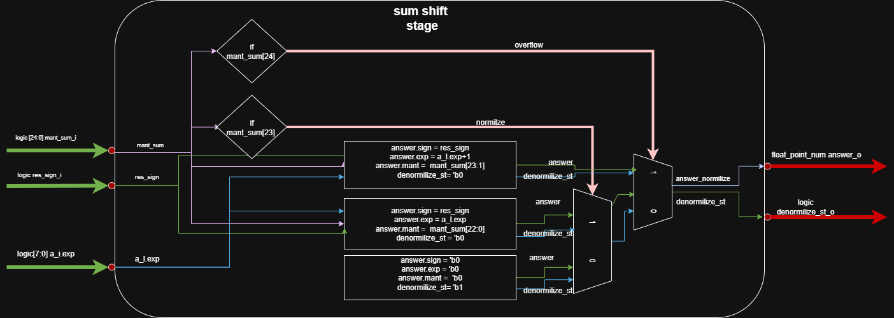
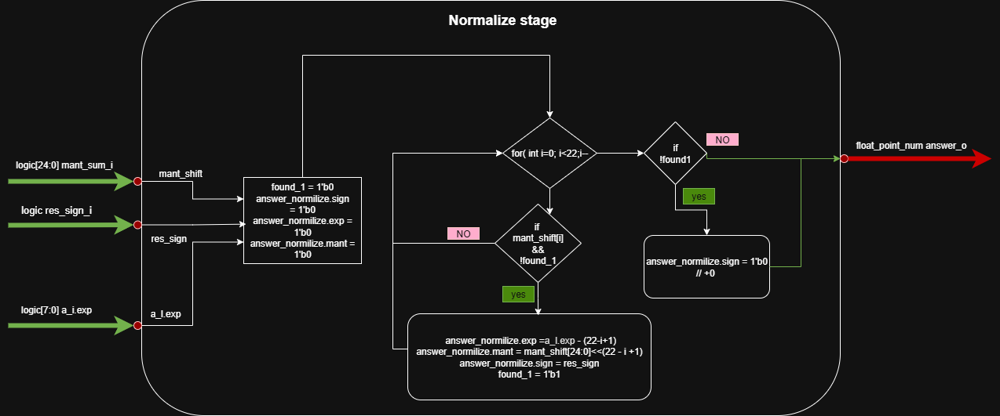

# Pipilined сумматор чисел с плавающей точкой
  Данный модуль реализует конвейерный (pipeline) сумматор чисел в формате IEEE-754 одинарной точности. Операнды и результат представлены структурой float_point_num (из float_types_pkg) с полями: знак (1 бит), порядок (8 бит) и мантисса (24 бита, включая неявный ведущий 1). Процесс сложения разбит на несколько стадий: выравнивание порядков, суммирование мантисс и нормализация результата. В первой стадии (fetch_stage) неявный бит «1» явным образом добавляется к мантиссе каждого входного числа (если сигнал valid_i активен). Кроме того, на этой стадии определяется статус операции: если оба входа нулевые, выставляется код ZERO_res; если хотя бы одна экспонента равна «11111111», – INF_OR_NAN; иначе – OK_state.

## Описание главного модуля pipelined_fp_summator

  ```sv
    module pipelined_fp_summator import float_types_pkg::*;
  input  logic           clk_i,
  input  logic           rst_i,
  input  float_point_num a_i,
  input  float_point_num b_i,
  input  logic           vld_i,
  output float_point_num answer_o,
  output logic [1:0]     num_status_o
  );
  endmodule
  ```
  * **Входные данные**:

  * `clk_i` – тактовый сигнал конвейера.
  * `rst_i` – асинхронный сброс.
  * `a_i`, `b_i` – входные числа (тип `float_point_num`).
  * `vld_i` – сигнал валидности входных данных (по нему «включается» конвейер).
* **Выходные данные**:

  * `answer_o` – итоговая сумма (тип `float_point_num`).
  * `num_status_o` – 2‑битный код состояния результата.

  *Комментарий:* Этот модуль объединяет описанные стадии в конвейере. Входные данные проходят последовательно через `fetch_stage`, `mant_shif_stage`, `sum_stage`, `sum_shift_stage` и `normilize_stage`. Между ними используются регистры (`always_ff`) для сохранения промежуточных значений (`a_fetch, b_fetch, a_shift, b_shift, res_mant, res_sign, a_i_exp` и др.) на каждом такте. Специальный сдвиговый регистр `shift_reg` задерживает код `status_o` на 4 такта (`STAGES=4`), чтобы он синхронизировался с финальным результатом. В результате `answer_o` становится доступен через несколько тактов после установки `vld_i=1` (начальная задержка конвейера – 4 такта), после чего каждое тактовое событие выдаёт новый результат (пропускная способность 1 операнд/такте). Перечисленные стадии отражают классический алгоритм сложения FP: выравнивание порядков, суммирование мантисс и нормализацию. Модуль автоматически обрабатывает специальные случаи (нулевой и инфинитный вход) за счёт предварительного анализа в `fetch_stage` и соответствующего выставления `num_status_o`.


  

  [ссылка в drawio](https://viewer.diagrams.net/index.html?tags=%7B%7D&lightbox=1&highlight=0000ff&edit=_blank&layers=1&nav=1&title=pipiline_fpu_summator.drawio&dark=auto#R%3Cmxfile%3E%3Cdiagram%20name%3D%22%D0%A1%D1%82%D1%80%D0%B0%D0%BD%D0%B8%D1%86%D0%B0%20%E2%80%94%201%22%20id%3D%22OFzG4s3xbjuP8PP5mnqq%22%3E7R1bc5s6%2Btd4ZvchHgkhLo9x2p7dOb1NszM9PS8eYpOYLTZeIE3SX78SRoAuxtgGQYLz0BoBMv7udyboZv38R%2BxtV5%2BipR9ODLB8nqB3E8MwHGyQ%2F%2BjKy24FYpCvPMTBMl8rF26D336%2BCPLVx2DpJ9yFaRSFabDlFxfRZuMvUm7Ni%2BPoib%2FsPgr5b916D760cLvwQnn1e7BMV7tVx7DL9X%2F5wcOKfTO03N2Ztccuzn9JsvKW0VNlCb2foJs4itLdp%2FXzjR9S6DG47O77sOds8WCxv0mb3PD90531fBN8d2%2F964c%2FvnxPgh%2BrKwis3T6%2FvPAx%2F8n546YvDAZx9LhZ%2BnQbOEGzp1WQ%2Brdbb0HPPhG0k7VVug7z0%2FJj5U%2F6y49T%2F7mylD%2FmH3609tP4hVzCyAbkIHvhaeGpRIAB3XxxVYU%2BsPNVL0f7Q7F5CRnyIQeOGlBP26s%2Fb%2Fzte%2BPLf%2Bbb5W04n%2F%2F9%2FgpiS4KLvySkkh9GcbqKHqKNF74vV2cl5AA5Kq%2F5GEXbHF7%2F9dP0Jad77zGNeGjeB2F4E4VRnH0j8ghoDEzWkzSOfvrsTEhBcLX04p%2F%2FIBdZHwCgECQ%2FFLku%2FfzP4g5GwyZZ8Z%2BD9K%2F8e%2BjnH%2FQxpzg%2FevecP3V28JIf7MVuEj3GC78OgDC%2FkkKtlgpiP%2FTS4BfPgCqE5rd%2BjQLyMAX1YFugHkegid2j5ndVGUbYyHb5jSxT2Cj14gc%2FlTbK6Kv4PeeQHO6D5Ahm45e%2FGPLpwY4wbMyOS9LIjhht1NEkACVN0k8fPsg0iXqgSTNXKRkm6640kR7qlWQfPJF6IYYut5Ph4q7IV61aoKxJeiTfQ9R7BhU1pCHcOgmdp9EOK36yC7Gz%2FMNK30u2O%2BPrPnimyOP0Fi8JrncqTKmdKpouV2Jkp2iTVtbvs7927AzoQo5DELQlQwMqzYyOUOL2YmPo5xijKcfgToTudRx7L5ULtlQEJjUy2eJlsmngWtErXo9cLJDG7glaFrfmaIlHCRDGTK%2BceFwHtEo8dTDVrQveY2jKnso%2BiS%2FpiJmR64hWdIGIJtnp7EoX7OFnKOPgLfIzaqoMzEGZT%2BhiPgksg7DTr%2FlkNkDJZnlNo4LkaBF6SRIseEzw%2FHMqMwhRGwt4LjEtFWgy3tkWKH1n5glbdQg67Ks25JMKmrACTWztTIcWCTY2Q8qx%2Fqxgqxuuze%2FTcTAGS7QVRsHDgixN8Iz8RnRNPpBly1tT5t7cJfQ%2Fbx5IJEi4KxXYn7D4hlIkQbVPKGNGeTBYeOF1fmIdLJc78e4nwW%2FvLtuKkk1ufJB98Yx%2BPdmLSPRkJ9yhRHGbaOML5JkvtSAOTINHkIMV0kBBZ6grcdAgsj0GcWAMSxyoreHjw1s2FDbSKw9sibh%2BhcsxcbvNi3VXNpdVVNQZszsXZq9YpcNkdmSh6ans7ohb6WV3t6H6B3cjkgGiaYdULrNOIcA8iyEls20hnlPEdypQQobKTeosl40vvquNBaworVUFUjrDSRPndVw4Qaa%2BEFxt%2BuGCk1o7Ty9Omnh1bxsnEDgDE14QuDIStBdHAeB4FYOaO4Pt%2BkTBwSg1zu3Nrus%2FILRFKdhZ2UbtD70w2JA0URP3dmxI6V0VyU7hxLBC6urdkQ8PafbDdwsUMBy6rP89RuzE1c59uyYXQHv7vLstP882%2BuCni1W2Ay1Yznclj73bmP8yslx5gBadURVh8VK8BUQ7TODVuZWmTrfSkm3zMQX2bUEjEaNQQohefMh2%2BbiCr7YlsIgjs4jW6KslW%2BVjCoSJHKISWXo5RDbivDkYDT4gQEMTWbIBdzdmhPTPIbLxtnlcz4l5lT4m8%2Bj1mU0QCJ0DSEHztgLEYldLeyk5WU3fh5GXzjPKnBNwS1BOnoJ16O0IkRi2LH5AQbRYBeHyo%2FcSPdLnJnha%2FGRHs1UUB7%2FJ9V5YkLYXp3ncAAHuilt6Z75nxjL%2BVwZ2KCx98p65Cz96ScqeJgpDb5sEO3ajN66JWx5sZlGaRuv8Ig2dcnwGxgINTWVo1CA9%2F7ZvxEn0Ng%2FkB5atVTyFOQoKg6gBF3sh4ZiNl%2FozygWJRGkthDEcVZyQL86ZUCDwS2H0ECwaXNd4KclEwV4vrKkIZrIm9O%2FTOkmTEGILNg8fs8uyJr985VuODLoUkdsJI9I8%2BIrc6G8kZTGjNbk01U1TmjfkGJbHmSbZRjHx8zfk8b0gI16fsMaTT9mDSDYiQyt66GguqBcmh3njhSe63txGRxVJa0qCNK9s76kqI2f95%2B2FrHohK0X6VjNZqWKBx5CVgcpyhbW3qYsSXQipO0JShS%2B1EhI0esnalIVVZS3Vj0m1lKpRYdXSAcBGEo3SoDUGwDyzpRM0LrZme%2FbcZgQNoRrfsK0qhRy%2BASNQe4Np47rru2lMKhDBRTLud8FwgXZ5yjzA1pkUCCIqndy2PDAoFpVge6rwwewpgyTH5rZYG9dietZQqAxR4sfBztrvB3QOnLLUPoMeQlPWQs7JyKmFZPCxX9Q%2B8Jj8fZVSstOcOASNxycwf7N3KSm25ubp7v1SUrgBW%2FVSEju47vqupKScobobsJScEuLj0YCcqYkwKP6sQYjNBvVfQxCbAiyJhAS4FpYdylB1K3Yvg2wEUXjvWY5aFN7YlPQmYiW%2ByYth03Y4QTwFRDvVC%2BPs6KsfBwSMNERczK7RN%2BKGVY701S4vS1RkUP4v%2FwyOel0EppbYFLSn5EkhrYHD7WYioU1gT7%2FB0XoE7GkX3%2FtkRYm3%2BoaO9ALs23axHKPKNPAUhtHp%2BDEb9LBFA1r3%2B85TVtDpF9W8bDSObJNqdbDdGRYtbOz3Dw7%2Fl3lOBoNBMTtN4T5qrYtmDzD2tsTmwx%2F1NCZikVCamQmKam1%2BI1ewoLueEAnlTq44SSUSe6tlJQzcLB%2Fdc01JQUbD0ME65nWeo2obB4%2BYizAYVXvp1St0JpOgVu%2Bqtkmz3ihUbdM5WZpUrUgoJ6taYSM2b0abrpUrihbhz%2FHoWsFk6ruAE7LxxkNq9keuyUFJVZDHErN86LXDLH%2BDoQhvXFthoXUM9906VlQNjBgppj00pJg9m%2B98pvdQrFRrPQwjzwaD8gdmrLMnHzGnWQKnWTaeor7tdbPnePVZzNZtWYXRdCQuNIc1E7d48guzFcxmY2tqKPok9Jobqg7m8bSfWUL3mWUpBaDm6ls5YDGmlkARJ7ap5BPNOJF9%2FDF1%2BpuYLyVSua%2BaESL30IypsVys7RoAQpTdJx0NPcm6U8gGq%2BB%2Bt9Fbn31iikJR1dDJ%2Bsr0IJzpySGF2VyhmErFFkgV0%2B4SThfT14UD9DPRJVnnQl6L2KoeRq1IYdXHep3%2FvaA87JKjHIKHXfL2BwWeSf%2BXIabQEANgljNlpTP98YACD8MNgJ3DO41ratlEvcHwzmXYrMQ7xUTg%2FjR6B3MXCZTULsgtnVIDbt%2B85%2BEKfWuWayh6Vw2gyF2LA2pbzBH03KA%2BOafup9uEHEuzHRaqzDHRL1SVfUZGL6ZfRe3Zw82yqpCqBuIw2mkdoTnW4t9VevB6J1f43TZBMahyQd08prQ3kNFPc6yN4bRIDBTGaqXHs9%2BGWLNBjKPXhljbMaaWqMkIRKBT9sNC2XzRPVKAmVCD0GvHCcBuM99m45pwNLDMtymHme6GLGQQEBmiyMMRww9IZ3sWPEPvxM8Ej8sDEjpEltcBUr%2FckeX3mNKbUtrAUvk4evNpivc%2BjSnB6QrGjiq60BVC1K9df1UtXJJyxsC%2FVytn%2BG52U4ezgz4H62XtfECEKbEp4vdoa4gDBqbyi9pyR5RgdHr2f48jMDasBEyR5UzKgSVXdIaHMambWUIPDoxyOIdeDxuTLBNzkLJZiqQHygbdULbpqllob3OVeAOyjVZZoR5D1fZlP5lnQ5OHZjVDZMlzqyxsTpVz1vWbyE1eEdXvsCrkysOqLMOdum5PzrlazQ1qjkr7vabnCFS3qanQesj5RAVviLkrs14MSjdASyCoTsSgnNCiYnBX%2FTZIMQj3je%2ByEZ4i%2BWy%2FopFp2YGLRnsvUCGYunLAps9IAnslWq8T%2FVodGnXyJCu98%2FyOmFDFLIKuzVqL%2BcxF0Sq%2FQ%2BMOf1OsHxS9%2FD0t%2Fsebx4Ljxwa3dCvmmekzDMvC1jEeRjdvNE4f6OKNXUJqX6zdPZVTbAdOLX7UpSG%2B0qe9eRhqG09ps1DXreW3Zw05fKmaW25hd8pmU1RUtKMzimnsNShHhRzbEpFjK97k7OrETIMMuu5uCli0TxzfTlH27LUOKVXd%2FrmNRm6jRqMjyvx2a8vgl7jU%2FjOKb%2FQ5vhuqWOOet0VpoOdFh5bwIhLLdlT5bK5sUTXfqivCVeWqj6OBOjKdJ7QidQ%2FWxyLZRYml6pNTveuyM7GufNtghqNk620a8f2%2BCuQyIl4gfbfn2JFumXLg3dKJdNVLloMpfTXfaHFi28oufq1okRMh3iZ58uMxmb6O2PHEimD78kj292zsFZAUOVfUirhaR8tcSuZGhSwll%2F4mitdBSMA9TzIvZ%2BTS0jEFzlS9D1XVuNNdaY3slUroeOvdVFhMzGOtnYi12boLXiZCyqVnvFw612W8OFqnaanti74n1x3XwbQXDdV4upoAFU3vaoi0%2Fu6o8xjn0vIOXSwqGtkA1Ms1vRTWynneZjnkKprOYCBF5%2FurYKBL37vEQKrMgVYGMnopuRhYM3RtN%2BzhurTWm8ZOrD8Q%2B2AR1wd7%2BAY7n8bfbaX6oOoVXiXBmfCNEJyZv2qpU4JTvKnAm4fKgOpAyiB5oBqgqMLTVfCohqNcmyEBcAj1joJIU3t2msu%2FFVN5a4hPV4JeKIxDrOKumqBX5TgNNiun%2FTqGi48lJT%2BQZU1ZcKAvKxHJSaljM5GHss%2B0PXXkwXWRIYvK1b7yz6hB98%2FY2NE0jCnqmR1N2aRpvTDgwo%2BygsRKSayVJc0GVtjoWNKRDRe9%2FKicgDGymg1RedkyUvQWbPQ85q%2FS49NtQkU13ug1xIMVw41GJ8rE4eaqtm%2B9ouyEmsOjSmrKqqmRWxcOEv08GfVai6mwyrQ4t%2B7c2WNmfo7itUfrqiZjeAMHtFzRtTNkPterHvtJ%2FBSTX1i7XjEtcP%2FIF6ZSr8DUBPaED%2BBbxgHFmh0dGBkzkAkHqJv%2BQf0TDsz8hT7dZpL2q6qz22Kg2Bczob%2FwLS2Bpu0eycrb0o8pkY3%2B74iiZLatsFOxXuGxQ9ZaZqTdlnq3i2yA6%2FJNeiajl2oLj6r%2FzOkqCwDBq0q2n%2B6RMGV3UOC5vb3WpPa5pSJ%2FCW19ZwrLxuycujGAqrCk%2FjShO%2FQ0IYGV1F2tClbozhG6Cu9X75tbHIcXEK57iml1uthwmha2MT4ditjoZfjiK56k0fV8DCxEVWDDiYjSRmXIsjAi9M7DcN%2FeRKR%2BBht1PoVTbME5meLs0yjuWCdP%2BqK2xxXtMYFfc%2FnfvUen7qjCBDc2wpUzVYI%2FXR%2B6jfWh2wmRH09SgrR0D7y5RbqBZfY6pUFXjhuwdwHH%2FgP5F5Uxyb1mv6YaLUPot3RV9eJsZhPnxHbWcqsqBRI5%2Bm1nbcgDCM4XxIqR%2F1rzNm6TUp3NkrBT9ESOFqGXJMFCdLaqYlaQfT6GpkL28UiaGaURcHOjNgKsLo2A86IMFeSpAkNs7UxTwcDsbWWMfBAQ3fHG5gJ2hL0Maa%2BjDYbWjVhVm%2F7YRYbbu8iAQA53XWTGsSZVTzLDgu3JDGJ1DU5mQKCKI7ZZiLB5XM%2BJlZc%2BJpdiBEOcXYstRymetE72YAOrKyQQRsHDgiwRmCECo2tAIScnu0Y3mocgkG8bUtZE6n3nEZA9hZLnJMwkT8E69HYgInqYBQQooBerIFx%2B9F6iR%2FrM5P7FT3Y0W0Vx8Jtc75VhUS9O80AAAtwVt%2FTOfM8Mmf5XBnMoLH3ynrkLP3pJyp4mCkNvmwQ7QqA3romwDDazKE2j9aRRRqgNjPP4tm1j6sgzCpUoh%2BJQ3xZxLrshX%2F7MUO6rctL0AsCEisymTRmI8XDo36d1HExk%2ByLYPHzMLsuCM%2FnKtxw4dCkit9%2BHmcWzIjf6G4nVae78hqpMKntuyDEsjzM5sI1iYkhuyON7QYZgn5DPk59k9fU0o1WRIkdTygFmO0xArN5MEUnQLCBkv%2BDfnz%2FMo3j%2B%2BfrzjjyYVLvQhlbasHqnDSj7Jn%2B%2F%2F%2FZlTsRxITjgRXD0QRxud8RBDuOIWumlK0F%2B2OoTsebpFf8H%3C%2Fdiagram%3E%3C%2Fmxfile%3E#%7B%22pageId%22%3A%22OFzG4s3xbjuP8PP5mnqq%22%7D)


## Описание модуля fetch_stage


  ```sv
  module fetch_stage import float_types_pkg.*;
  input  logic           valid_i,
  input  float_point_num a_i,
  input  float_point_num b_i,
  output float_point_num a_o,
  output float_point_num b_o,
  output logic [1:0]     num_status
  );
  endmodule
  ```

* **Входные данные**:

  * `valid_i` – сигнал разрешения работы стадии (при `1` выполняется нормализация мантисс; при `0` входы передаются без изменений).
  * `a_i`, `b_i` – входные числа в формате `float_point_num`.

* **Выходные данные**:

  * `a_o`, `b_o` – выходные представления операндов. Если `valid_i=1`, к 23‑битной мантиссе каждого операнда добавляется неявный бит «1» (формируется 24‑битная мантисса); иначе операнды выходят без изменений.
  * `num_status` – 2‑битный код состояния числа (`OK_state`=00, `INF_OR_NAN`=01, `ZERO_res`=10). Устанавливается в зависимости от особых случаев входов: нулевые мантиссы и порядки дают `ZERO_res`; все единицы в поле порядка дают `INF_OR_NAN`; иначе – `OK_state`.

*Комментарий:* при активном `valid_i` стадия добавляет ведущий «1» к мантиссе (так как в нормализованном IEEE-754 формате мантисса записывается без ведущей единицы). Проверка особых случаев (ноль, бесконечность/NaN) производится до сложения.

 

  [ссылка в drawio](https://viewer.diagrams.net/?tags=%7B%7D&lightbox=1&highlight=0000ff&edit=_blank&layers=1&nav=1&title=01_Fetch%20stage.drawio&dark=auto#R%3Cmxfile%3E%3Cdiagram%20name%3D%22%D0%A1%D1%82%D1%80%D0%B0%D0%BD%D0%B8%D1%86%D0%B0%20%E2%80%94%201%22%20id%3D%22LhLpFDnKxOo4QxDSPJhP%22%3E7Rxbc6I6%2BNc42z60Ewjh8qjW7tnZc7Z7OWe23RcHJCq7CC5gq%2FvrT8JFIImKFtDWOp0O%2BSAJfPcbdGB%2FtnwfmPPpP76N3Y4M7GUH3nRkGRkG%2BU8BqwSgISkBTALHTkAFwDfnD06BIIUuHBuHpQsj33cjZ14GjnzPw6OoBDODwH8qXzb23fKuc3OCOcC3keny0O%2BOHU0TqC5rOfwv7Eym2c6Smj7wzMwuTp8knJq2%2F1QAwUEH9gPfj5Kj2bKPXYq7DC%2FJvNsNZ9c3FmAvqjLhy28c%2Fff154Nqf757cj5G4f0X%2BSpd5dF0F%2BkDpzcbrTIMBP7CszFdROrA3tPUifC3uTmiZ58IyQlsGs3c9DR%2FU9kOOIjwsgBKb%2FI99mc4ClbkkuysDNI5KctIeorBp5wAKINNC8hHIAWaKdEn68VzvJCDFDViNPWln31ncoeNwZePiu398G3j3ypowjbhm3ToB9HUn%2Fie6Q5yaC9HJCCj%2FJq%2FfX%2Beou8njqJVKgTmIvLLyB07rtv3XT%2BId4SmDICMCDyMAv8XLpxRbwH5rc9kjAu3ESj0F8EIb8EBTKXPDCY42oarFDcUIVvpHWDXjJzHsqCJSBdP7QaBuSpcMPcdLwoLK3%2BmgCIb6ajERhAw8rFrgqwDhnGSe8jZaP0wh3PWURiJ0D5Y3dP51xrKxg%2FFkzfLdPVktEpHL4QD9VfCgVBugQNhBd3musTe4t3q3wzniREeO0vKoCWGcammvrLN4NcF4ZBuwjsyuWloGJRbLrcy0tj3ogJ8HP9qszigLPkG4iyOJDA4UlP2RjmqVpCKKgFcox1K4XCBRkcT6GdRBx1HYgZIUiijliVmk1xwktSTU0lqQmKgdmSJUU%2FAIQMAASzEPQDSTa9fsznUq0qPcprmUEH6fuZQgbB5c6i9ZIfsVDlQfS0cqLXAgfqbQ8aaFwXJ10c2MMYbVTRNOy03OVu4baJIva40kHcSBQB10L1tmShQPTZRJJ4GrVpQ%2BQWlNLJk2UsLgbL7Lkme6pIn6NnOIzmc0ENz6F6HzsQjF8bXAHPYQT0oddBNdjXZvTBhwxp4OSdDc0Yl1rPCeXzlekmHrklGXRnuu%2FDMjM19slJH60nvLCkWa26zZBuK8S6IdyGXb9xrYwYdtJNBh4jJZCI%2Bg76GFZWC2phSqJJlejlaomU%2FO4vgjuBoP4%2FqShUtYbFawtpfS1g7tIR1qJaw9tIS1ovSEqpSdrKByMluWU%2Bg46qF%2FTKfR9YKalWtAE5LK6icVpBEgtsgCHBcFk7NOT2MiKjhPz59gN4cBw55ZBwU4Z9z4C4hjQOJlOmkmE8jgl7fI0OjrkSsqjCRssKbelGtXEZNUfcoCbQ6vHi8dKL7XO7J6CGTenKcqwA6yDTAoZrjGVJfNelm1C30G3Jkqs6UAtgujOSR0mnbsm2atmOl5Jm5lTbnAUucXENqTuJzc2%2Bqqy7VJeuawP9oV3lVyfJ5dpc2lpHRyDXD0BmVUVfWZRsRVZ8vX2yLEnZFJbDa5VxjqFBZzlXAtDkozEob5Ly2nhu%2BncscuhyhCR9HZdKaLg1TCN0JMWMpotzujEy3m56YObbtbso1VmSMfXJ%2F2Zx1nC%2BSIFXAFLApBz4TGEHIF85Nr4Rh9feCNj%2F2KKKvKJKuZr5NTnXp%2FSc4yy8qBGSFgCpZc0NE9RwCBjh0%2FphWvBQlV2pTyLqoRyM7shZxQsJcQ5Y9Dc%2F3MOOWpKBa6A7LdIdpYbRIdaVVqldJ7%2BylN2sKyVRgGsQjFTiC8o2mChxB9Vk6G56WygZKXa6ZxHZIscq%2FaZXNZ5Jc35mMqIMU54qyhIswcXs2igEgxiCovGJYk7IdzVClWeoMNAM6cc2gH6wZdMYW6XK7moHPJj269nkJPVMBVngfUMRLzcm89ibzhUaeU5X5rPvpAJk3mJVU6bplf4BPxFT0B6yzUg1KWTkrsiLso2pTO8DjNre3lqiFVbvblWb6cwX5VZU8ryYpsh7%2FN0qsoaN2JRiKHEOu%2FMoKsDO%2BuCAefbEkS6eCdxa47BSSpcl%2FbggurOdMpjvHVeYDNxbMvaxcia4zqewtZsMwMqNF2Mnq2j8GX%2B%2BGAX3VtlfzLWE3xJQbCOkuGMSkCL0sY0WKx1qf%2FhHMsZOsDZNaQKUAb5%2B6n4Z%2BMPzw6bYpzB3hoe4%2BxhC85ZEYFd5694KsqSX9hbIqdzEHlum0UuOj0phl40ORY5i6WmqhG8ylfLC93J07qxoiN%2F2SgMqExjvf2mQmoDT%2BEr4kIJguiffb3y1nG3pkg1mpaZN%2BCqX%2Fg5pwCn2BAKhllte0HSwfjwq11Wf6jVXr%2BycjL1AcVm6WF2aCKumdPeSFDT6RpFwbupH%2FDpQeRSpLj2LI1wqzWMMCpMicATmr9DXLGbLgXYZW61oKX9c6q%2FwBa5sUKGoRbZckop5i1uo0%2FM5Pv39a7%2Fwglfd9W33nJ%2FvGUYEoxaiiRnFpqbFCKufNkMYjWBMguLHQQqm9jMa4TTj5uADL0WUZSD8hIJSBYso866SUOoU%2BynVXpbiT8nCHqWqjY0tpdoP151mpq%2ByRGCffD6lUiXjPlC0rd923xJc6y01ybXypnRxf1l6BfD18Wbnc0BZfcvFcXXyJ1GoljRb5ki9bmkO%2Bo%2FvVxhM627Cq6pxf1W40wTd8W%2BdMEAiPHN6hbZHE0K%2BVMu3EEiyKEWwvlhiN7j7Ywerhfvx1fPd4r%2F6Wlt%2BFHzNNajwWW16iQWwJ31k3Nj1xlfAs7daWtPmyI%2BrWvsXRaBqvQL%2Bzm5eSkoXLmxGwtbG%2BdPp0VtjklaAgJdUkS2SYfzg4MU7515fh4H8%3D%3C%2Fdiagram%3E%3C%2Fmxfile%3E)


## Описание модуля Описание модуля mant_shif_stage

  ```sv
  module mant_shif_stage import float_types_pkg.*;
    input  float_point_num a_i,
    input  float_point_num b_i,
    output float_point_num a_o,
    output float_point_num b_o
  );
  endmodule
  ```

* **Входные данные**:

  * `a_i`, `b_i` – входные числа.
* **Выходные данные**:

  * `a_o`, `b_o` – числа после выравнивания порядков.

*Комментарий:* Эта стадия выравнивает мантиссы входных чисел по одному порядку. Сначала вычисляется, у какого операнда порядок больше: если `exp_a > exp_b`, то полю `b` присваивается больший порядок `exp_a`, а его мантисса `mant_b` сдвигается вправо на разность порядков; иначе аналогично для `a`. Таким образом на выходе оба числа имеют одинаковый порядок, а мантисса меньшего из них выровнена по битам старшего.


[ссылка в drawio](https://viewer.diagrams.net/?tags=%7B%7D&lightbox=1&highlight=0000ff&edit=_blank&layers=1&nav=1&title=02_mant_shift_stage.drawio&dark=auto#R%3Cmxfile%3E%3Cdiagram%20name%3D%22%D0%A1%D1%82%D1%80%D0%B0%D0%BD%D0%B8%D1%86%D0%B0%20%E2%80%94%201%22%20id%3D%22L2ttTz-aTAPonEuvQwmh%22%3E7V3fc5s4EP5rMnN9iEcgJOAxduLeda7XTjNzbZ8y2MgxV2wcTBKnf%2F0JIwGSsME2v5ykLzWLLMTut59Wq5VzAUeLzcfQWc0%2FBy7xL3Tgbi7g9YWua4aO6X%2Bx5CWRmEhLBPeh57JGmeDW%2B02YEDDpo%2BeStdAwCgI%2F8laicBosl2QaCTInDINnsdks8MWnrpx7oghup46vSr97bjRPpJZuZvI%2FiXc%2F50%2FWsJ3cWTi8MXuT9dxxg%2BecCN5cwFEYBFHyabEZET9WHtdL8r3xjrvpwEKyjKp8wf929%2Bnj9Ofy07%2F%2B01%2FLHw%2FOP9b3S8y6eXL8R%2FbGbLTRC1dBGDwuXRL3ol3A4fPci8jtypnGd5%2Bp0alsHi18dlsdFX8CCSOyyYnYKD%2BSYEGi8IU2YXdTjTHI6Aa7fs4MYHLZPKd802RChxn9Pu070wv9wFRzgJoqaIks3asYb%2FRq6jvrtTcVFZNpEdArqp3w5Ud8MTARv%2F6Zv3m9Ea5e2NVO%2FUZOeE%2BiPe%2FAx0xcAfGqGXJqRgVa5rKQ%2BE7kPYl%2BUqR59oSvgUeHnFoZ6VCwsgUk462Dx3BK2LfyuC7pyJY7SjSjdLQFQvrax2OjAApUw7fsMgijeXAfLB3%2FJpNKYMja%2FB0EK4aX%2F0gUvTA%2BdB6jQERThp9DwDPzfH8U%2BEG4HSd0dAD0GH3rKAx%2BkdwdPAb0X3qHMx%2BMe9x40Q8%2BCvp5%2B9wBYlfZg%2BOLUtAmNt6jXGhWRDefL0rRfRhsqUs7L7kGqxhF692ohlAEI2ITxS7wKu2RLmE0GUHxt1Nm5N%2BGqJIP1QV92CPo53j0DaIfvQr0GyY4I%2FQb7%2BjvB%2Fp5j2eOfstEZ4R%2B3B%2F0a4dBHwAEyKwI%2BgBo18NRD6DPbXsuYY9uiVDGAO6FvtJeM0%2BAPgbtQt%2FsD%2FTBQD%2BQ%2BF8V%2BvsR9pyKfsM4JexpG%2F3WO%2Fr7gf7KCZ1%2Bo99Gp4Q9baPf7hT9moj%2BMvAfD0KtMgX3A4TIsARYmADsBaFpwH3tRRDWhR2uVCGNjH2q3qHrPdGP9%2FFHb8aFk5DLnDtvQDYreuks4oT7crJebe0LUtG2HRVM0qZ%2BIhnn%2BlbAG86DxeRx3Upe3zDl9ZGa19eKMs4abCyvrykaaXUyG9ST%2By93Z73qnNLMUlrxP1vyP4SrJe0P5QVrx3N28YLc3irhEcPe274hHtEVHtH2UUOXIr75mTnYeu6s4o8R5RjyO4jfdLgioUe1QsK8%2FGsmLGOnmbchfPM42WyLKDqDJb2093pOdfbCUtiCYAF76QXsJSO7PvKCCgz82GvC2H%2FjGUBSPH3RSFSb43v3sY6mVC1bNcfq8KaOf8VuLDzXTTiPrL3fzmTbVaxQ5ne0XzS8QNdxX5Tm1pkFxPh6GSyJFIwzUQ2WQaYthoTYHCDFNlaBaZqbVzrODUubymUJshMmFnRecSKW%2BN0QFx%2Bl7ZHdBr8jxbEnOwPAy%2Fjt%2BV05uhMQ1UKEJ23FG7rqhy1zJFZUuTuWvsyHzz1TJQSdTzedpD3ryN%2FsNEc5a%2BFGWKtyRvDgYhhDk2CjNRNXywPmz2mWFztJPdaycZrNzID6kZDEwdgomZ63V7lo%2BMRCsLZArezuW8eCGkhgk72jJlDLA4b78vK1gbrbjCIYQF2MFfMIrQWQ5UEkrorcngSRWMIJ3J8kkNsjaDePKx4b5CIfGtfcud5spgDuta4MTSnjmBYI5yuJ21wXpq%2BQj%2Bz9wcLZwkXO5UqZXWa%2BgpRx3Mc2aAXbPul6wD8gB9xCMCtXunSeO9HVFJpTgyEcyRCTnhvCLiitb9kQhmKI91xm47lMJGbMLKtzGKgpDzUsOuiExU41le%2BBGBWjjHYOSpiaaCzz2IMSymyoSx01fVBCzcWcaOPiwgxzf2VGLvS1bF1ci9lWulo7JPSVloizGcHTqRLq%2BDE0Ll0n%2FPUHbXRt2sPYklSXcKiPhuPxh8OSF6VhNVfvuQFezrlqQKadqojHttxTQ%2BkQLM%2BrVklaWW6P9tQ%2F1uZ%2F5hvxPxcRyzVK%2FM%2FShxDjxP%2FG4xEaoQP9ryfegpAMJetYZxErq2x5FVSXr2jFA945Lrm9uNpuyFesvvkKNARfKdvS6888dW7Tj%2BxQllmTQ1moncmHD7jq5GPZWgsOZffNoTQIpckHH5X37GTyOXunkn3haKfiOGp4luIDrjpLWRg371Swk%2FLFJmeRXXX%2BR1c6lzoKO3Dd%2BG6YBoCIXFxx%2BV1QuywmBJRAbYcvHeoCNigOCHeNS26PjT2F%2FbW5QME00t1xlDKYqoCvb%2FbY6QLliQKjoq9w4DXtK5Z0yMNmZNpWpgpWWSn7vrdak%2FJ8rrNeJT9MtE3sSiYXDXuV1BZsDWvbcTXBBwUK%2BUKDWbCMBCaO%2F9WTIk5%2FgCkt1mcqyKeIi2r1m8oQw%2FpXZEc6seSyGDj2dsdcsZN%2BbeKCghB80nzFsdmXwE6GiXlcXKfJeAPV4rraXF5dnzh3noKw17pTzpaAaakOj7JzICr6xa3GNsr5w94ZOFd6bHXLwEaDv4J2TgzMsdlPBsYADqodiVWLOuUAHkhk3jAHG7oCsMkb4mBL5GBUUKzULgdXSdm9bg62scTBbJ%2BuMw5GVebFgzhY4lKCNCPHmMUWGupb1W8tNBqJFspzbMs%2FnFB1ddoOL2tA2n1GphTSVo%2BNpewpwqcmPeumbqTGBs6dWi%2F1WqlbA8AQLVRQ4dgqefO0ZtvkrQ2vtBu9lLwBwDdX43bJGxcVO7ZK3uqB3XfyPjQN3xZ5y5RrHxlUK%2BTN0%2BI9Im%2B1Bnfylskba12Tt5p%2FfksLIayk%2F7u2h5p7flP2gKI9rK6zg6goWeu%2FGXukmQF5A7gre2B1VfqW7IGlCn2rINBs1x5FgSb7TbHs9FEiiANwwUz44THgNy4ThV7RBpq52iRfY%2Fd5R%2BzM1HruzZKO4r%2Bokh14SvoXn0nFk52noE5BSdE6puKxkAMOUUnr%2BjTmzK8rLLMZey%2Bx%2B%2FlhZk2nw4f1l29f9S9DJ%2BJ%2FgkJ2v%2FQ0oDpVtf1zFlDazCg6idmUixSqTPWQSU5l8exe9Gt5LWtNl1awZsE5rSKtyefjK2iNXmZ%2FiihZWGR%2F0Ane%2FA8%3D%3C%2Fdiagram%3E%3C%2Fmxfile%3E)


## Описание модуля sum_stage

  ```sv
  module sum_stage import float_types_pkg.*;
    input  float_point_num a_i,
    input  float_point_num b_i,
    output logic [24:0] res_mant_o,
    output logic           res_sign_o
  );
  endmodule
  ```

  * **Входные данные**:

    * `a_i`, `b_i` – выровненные по порядку числа.
  * **Выходные данные**:

    * `res_mant_o` – 25‑битная частичная сумма мантисс .
    * `res_sign_o` – знак результата сложения.

  *Комментарий:* На этой стадии происходит собственно сложение или вычитание мантисс. Если знаки `a_i.sign` и `b_i.sign` одинаковы, модули добавляют мантиссы `{1’b0, mant}` и передают общий знак. Если знаки различаются, из большей мантиссы вычитается меньшая, а знак результата берётся от большего по модулю слагаемого. Итоговая мантисса (`res_mant_o`) представляет собой ненормализованный результат (сдвигов пока не делали), а `res_sign_o` – знак суммы.


  

   [ссылка в drawio](https://viewer.diagrams.net/?tags=%7B%7D&lightbox=1&highlight=0000ff&edit=_blank&layers=1&nav=1&title=03_sum_stage.drawio&dark=auto#R%3Cmxfile%3E%3Cdiagram%20name%3D%22%D0%A1%D1%82%D1%80%D0%B0%D0%BD%D0%B8%D1%86%D0%B0%20%E2%80%94%201%22%20id%3D%22NcSPnnnekI3_OT0TuK_H%22%3E7V3bkuI4Ev0aYqcfitDNkvxYUNOzsTsTO7G1Edu9L4QBA542mDamq6q%2FfiVsg3UBTOELBfRDF5aFLSnzHGWmUqKD%2B%2FPX32JvOfsjGvthB4Hxawc%2FdRCCBFHxR5a8pSXMgWnBNA7GWaVdwXPw088KQVa6Dsb%2BSqmYRFGYBEu1cBQtFv4oUcq8OI5e1GqTKFTfuvSmvlHwPPJCs%2FS%2FwTiZpaUcsV353%2F1gOsvfDKmb3pl7eeWsJ6uZN45eCkX41w7ux1GUpJ%2Fmr30%2FlIOXj0v6vc977m4bFvuLpMwX%2FvoPn%2BA5%2FOfr9Dv715fBv1%2FQZ%2FcBZ21L3vIO%2B2PR%2F%2BwyipNZNI0WXvjrrrQXR%2BvF2JdPBeJqV%2Bf3KFqKQigK%2F%2FKT5C0TprdOIlE0S%2BZhdlc0OH77kn1%2Fc%2FFVXnSZk18%2FvRbvPr1lV5MgDPtRGMWbpuKx4%2FMxEeWrJI6%2B%2BYU7HA0xpds7ueSwfOJrkHzJGyI%2Bp692sqvdi%2BVF%2Fl5zqLPRX0XreOQfGF%2BCMp314qmfHKiYP1EOf%2BEVmSh%2F86O5L0ZCVIj90EuCH6p6epmWT7f1tl%2F9MwpEoxHIEIk4Sb%2BS4dF1QZczF0OACRFqTdUHpu3OnlFULv2xBCiPZdQVY6o8Kh0r41GPcey9FaotZYXVgQ64%2BpvY4ZZp9V3XKdYXH9IW5FeFwd4VbaB0AqzIh4KVCZLTgXahsIJuQ7D6OPoPSf3671yS%2FmOMjwBgc%2FWnHwei335sn2wmE5%2BORjYMjJk7BHYcNYwK59ImG6pNNsxAxbsnGF4bwJD6Jq7bVUYnz6vvMqV%2BPYDkbQBSQ5CHAECODUH0MwAAHIDwaTMYOQtFbtmphTQDIg5VEFk0fw%2BITtV8jtU3UYTr18xsuH944ToboWDSQTQUQ98bBz%2FEx6n86A2C7iqYLkRVWUtWBMNtWVpdvL%2FwDUPj41k0H67FWPReZkHiPy%2B9jR68CMdV1du9uvPDjxP%2F9aCws7tEM7MdkvXzZedEwpwIZkUHkjBdukUVKcji9KHOferCWMvhG%2Fjf115oDJfoaaKOixfKwcZPIzEucprsyfEIhK%2F8mN2YB%2BNxSh3%2BKvjpDTePkvjMNE881%2Bl1nCf5LMEWq5Q4oEEJi2jha%2FyRFVUgGsqxquUAGKLhFslgUJdYoDH2d3LeN1alDX%2BnGXZmGjtzUhc7629isAG7IR%2Fv8vR8eVSsWY6UmniH0EbFoDbEY2NUvUEUD4aDDR%2BbfHCtXOwwzaqHFtmARsmYGKIRXaDeXCrmYrhabjoOLqIIGHqymnlL%2BTERQPJ%2FRrKnvWXBr92WF5zdYxCcBK9%2BHpiHm5knEYQZSR1zD%2Fqr5dWAMY1E0ZZEi4qALIpAa1ME564IjSsCdTRF4BegCLQN8yyPHIEuysNFXzuFaJE1dLSz0ApB36%2BdQnis3MIKBZ4Lmc0YRE%2BMWmJdB6fq40Zd2bhVUy4343vV8N1GnaKDVVhmrF21xIQV9PIBdAFih5VTXOgx1oLCcoIVje2CSsK21ANgMrGpMmYA9PtXr8quFoIFsC7%2FhO17U70eCjfm6bm3SAar9TyLFYn%2FWQ%2F%2BbSgmiL45eab%2BymrpLRQw0e9ruTDfk5b3g5wLH%2BbRWNx6FLUWUTY57qoV%2FKCCC5Q%2BNb3Tla3qsE1zUK%2FRRg1LNMrw6ITbMCgE3Nobt8yt1F9vbc4xt1Ohv%2FpdT4z3hm4L5sx20b0Zc8YMuLaIlzKqCR4uDsKXi5ZNEwtOQgaEtqR49E1Db%2FRtusHlwyidm%2BW7hHuyWOXQk2RZuBdKkDyMvfjbL%2FF0%2BEuqEiD%2F8yn9K%2B8gx0kvih8%2BfbL2IBu3D92HA6Ro686FcyWn7XMlMh3rBm1sNWkAHc4a%2BKCu3zans6V4%2FqlGLtW01KVENXKPf2O7QFCrWbwF4Hun%2Bdbn2OPTfuuWyelmQKtNLmEWtCT1o2%2Bqeu4E5ebsSs2EC%2BlDeTPhGlyuHd22aEagVsyIPcv16MQs%2B2tKfGwqHdjQQjMd%2BJ74yHkDmcjoona43DT2%2BB17l4M90IQP0u42GLkmBaEKQAr4EQRaF5WueYdMQ7D8ODtkeLZntV5stLxFpsuZigyXkvcgo93l1g8XPiL7NsTsDR%2Fp36C4kfBRq0kvKkWy0pFPTBS6h4L%2FP55O5z5KCzp9npfbakLKe4PlkNShMQ3nT31UjWllV9rZJMPoFZAML6sylecpnacybpsqI6wklypqgzEqqzcIKuty4lmkNa6x5eJ9SGXaYzTlzHKyr2HuiQS0y7C7%2Fac9mJMuKHdkRlWWWb7zobCwd3TlYRItkod0h4dcIYBg%2BdqxLQ3slq%2F2LAlo0LvWbSmcax4htC0i2LZv1rYvBZvrubmUpHTLiN3dI%2FXduvBW6ukjb0zqFKvgtu9CYY1KHZ0t9VPAfpti1zxsxtoHu7k%2F8A72iqWO1F3gLiOtg93cenif2SsXuxZOs3J8s2A3NxrexV751K6inVuzQpoVO71zfN1ShxrHg%2FY5%2FhIOYioRa9pFPByc5xSkUQuQxw%2BOBTw6SrDjWOJDxRGJjOWPRiScDIV1RyRcrvoWLqLvTUrg%2BdLuNlGe1LSQyqnmEFF8uGVU7yTSAFPDShVuJSJYSRCukKgAAVHxgo8CxhYb3IuY40DAzQCBa0cCcgJK6a6JKH3VXn9Q6zu0yf5I3X2Gr2aG59ruZu7Stmd40sppXtWczXVdiU2oGUaDWuoedd692EAc1WDFpc9LrYyzbAFHXZ3DMFiupNoeSef3Vsv0SP7NyTGabhW2QAhlekyPn5M7HLBgdiA3QRw6i06ynZInK%2F9Vwynbnx7YLh4hg1Hsx4XVxSi2aKAuk8X4Uf7agWT00FutgpEqCpVg3ssW51o99CwThZQFdEFQjkVQedmZuHfsWYYngx7q%2Bpb3synIm2HHzUatGzEhXKiOfm4YFJSINGo%2F2MKBt83AHDKLVdcsB9uidbfIwWUzyFrhYJ4v6pzKwdsj9HYp4E0bXsxQsOENsTDXWNh6UE6zPGyeK%2BUNbueUbH1DEiNtz4vmuUXDW5IH1hnKNic2KhHnHunoXESko7FNzfpuyHd6PI7uOukqWtGJhEaDj2wE0%2Bs38vsXjsWQbHQjGODaHkmHsSNYqmSXsm39YrfsyB0t0ZrQgzCrdv2w9KbmpqCnH0gLYCnEHN2FyXXo1bafGR5uV8P7n%2FNTmeqFdpnA3XW78hDovjy2rdA06ss7ZsDLFMtJvrzGh74DSYH17ELqoc3ob4TU76tCKvrqzdocpZeBm%2FHvISRa4pZjHF9cOs6KgJ4Edv5RyFWHARwz%2Bpfn8A0iQ0uv1dmRP0arzXe2eECjv9LklIkA3hiZu7B9MjfjZncyPzW5rSUyd3F1ZO6iCyRzM4QoyXyTvHNLZJ5v2s3J3BrcdWsi8%2F5Xl%2F9jsf7uDIPfvf%2FhxfqzSx6QhTTSTKqhfpxj2VQttC8H%2F3lz4upz4gkQ7kvX2hYPa0nhss1GKulVIGf9t3scxxQyApZzF4lzspTFZRzJUd7BVfRq9kc09mWN%2FwM%3D%3C%2Fdiagram%3E%3C%2Fmxfile%3E)


## sum_shift_stage

  ``` sv
  module sum_shift_stage import float_types_pkg.*;
    input  logic [24:0] res_mant_i,
    input  logic        res_sign_i,
    input  logic [7:0]  a_i_exp,
    output float_point_num answer_o,
    output logic        denormilize_state_o
  );
  endmodule
  ```

  * **Входные данные**:

    * `res_mant_i` – 25‑битная результирующая мантисса из предыдущей стадии.
    * `res_sign_i` – её знак.
    * `a_i_exp` – предварительный порядок (экспонента) результата (обычно равен порядку большего операнда).
  * **Выходные данные**:

    * `answer_o` – промежуточный результат в формате `float_point_num`.
    * `denormilize_state_o` – флаг «требуется нормализация».

  *Комментарий:* Эта стадия выполняет **первичную нормализацию** суммы. Если при сложении возник перенос (старший бит `res_mant_i[24] == 1`), мантисса сдвигается вправо на 1 и экспонента увеличивается (`exp = a_i_exp + 1`); если же старший бит ненулевой (`res_mant_i[23] == 1`), результат уже нормализован и сохраняется текущий порядок (`exp = a_i_exp`). В этих случаях флаг `denormilize_state_o` остаётся `0` (нормализованный результат) и `answer_o` формируется с учётом знака и новых полей. Если же оба старших бита (`[24]` и `[23]`) нули, результат оказывается денормализованным: устанавливается `denormilize_state_o=1`, а окончательная нормализация отложена в следующую стадию (она идет параллельно этой стадии, но благодаря вставленному биту в `denormilize_state_o=1`, потом выбирается ответ между этими двумя блоками). Таким образом, `sum_shift_stage` отвечает за корректировку порядка при переносе и идентификацию случаев денормализации.


  


[ссылка в drawio](https://viewer.diagrams.net/?tags=%7B%7D&lightbox=1&highlight=0000ff&edit=_blank&layers=1&nav=1&title=04_sum_shift.drawio&dark=auto#R%3Cmxfile%3E%3Cdiagram%20name%3D%22%D0%A1%D1%82%D1%80%D0%B0%D0%BD%D0%B8%D1%86%D0%B0%20%E2%80%94%201%22%20id%3D%22BokMvP-zr9lAmjVvTZIs%22%3E7V1bc6M4Fv41qZl%2BiEsCJOAxTrp7a3enamp7q3Z6XlLYxjbb2HiBdJz59SuBhEESRra5OU5eYoQAcc75js5N4s583Oy%2Fxt5u%2FVu08MM7Ayz2d%2BbTnWFAbDvkH215y1scx8obVnGwYJ0ODd%2BCv3zWCFjrS7Dwk0rHNIrCNNhVG%2BfRduvP00qbF8fRa7XbMgqrT915K19q%2BDb3Qrn1P8EiXbO3MOxD%2B9%2F8YLXmT4bYzc9sPN6ZvUmy9hbRa6nJ%2FHxnPsZRlOa%2FNvtHP6TE43TJr%2FtSc7YYWOxvU50L%2FD%2B%2Ffv%2F31LM21vpPBJ7%2Bsf77%2Fl%2F3ELAX%2BemFL%2ByV2XDTN06DOHrZLnx6G3hnTl%2FXQep%2F23lzevaVcJ20rdNNyE7Lw2Ij%2FenHqb8vNbFhfvWjjZ%2FGb6QLO2s4jGRMZgyXHb8eOAABp%2Bu6RH4EWKPH2L4qbn6gDPnBiHMCoUyJKv6CCAo7jOJ0Ha2irRd%2BPrROD3QD5OjQ559RtGPU%2Bq%2Bfpm9M6r2XNKrSkpAwfvuDXZ8dfKcHE8QPn%2Fblk09v7GgZhOFjFEZxNlITewAsl6Q9SePoh186Y9oAPD7S6%2FdB%2Bgd%2FKvldeg45OjyGHvCn1HI6iV7iuX%2BEmA4TutSLV356TDwZ2Smtj0pO7IdeGvysglYlBNmlD3HsvZU67KJgmyalO%2F9OG%2BoFEpkC1IT%2BFrisP2GLILD5iGtGh6tXO8iovn%2FOD3aVgIOChudDwxoEGmcIbB2cLGg3ACo7%2Bt2PA0IrPz4bZT0ght%2BxZcRIQmcKQueagtDlI5WEbuzQQww8df2xdbT%2FyKHqDAFVESfAczPASTgxnmwMQHGG21vVmXACoFGFLzSsc%2BDb75THTZjRALiwS5koYgy0RFHWBAIiHKsbTWCKmsA5jlSpv2k1INs81r%2BK7LYA6Y4BkM0T13FAWq5gngJj%2FIDUt0FRT4CsmekuByQy38XUbLlHrOK2AMnjDhV%2FGIcphU2Uje6AVfy%2Fl4ifuE8ytD2QDu5un0kmP01%2Brej%2FjbdNn5OXDb8fGV9%2By%2Fy0pAmIt5xWgeuFwWpLfs%2BJtFPYTKlPHcy98IGd2ASLRa4jfDIeb5bdiuKE8ZLcF03v0BO9F1EL%2BZizW1exv422vqAoWFMt4PTde1OUAwAnDGMlB99WuPciIlrz7iGs5Xqy87Y6XIeghu2EFc8JZc%2BB7fk9b53t3PYtMR33ynQ50tX%2F5OsZABhINfniLwAorGHrolmPB1SaZz237VnvMl6ZEkCDJUfUIvh5QFMDaim67mnU8n4TLRh0txELY8rgrep%2BQY%2BjKfE8EL25t6GXb2fJrnSNpN9r8F80V95DjMGuo83sJekl%2FmoJBoTJXYVy%2FBUqoAo7C7%2FCqwkyDYxvpItve1z4RuPEt3kL%2BLZMV2GA9Y1wPAjCD26sXWRVvpdP6qVY4MyDvqGCOQD488OXy0Ct7aqObNKWc4tQBhMYRROQpC9Zezv6MyUQ9P%2BK6JtOd6WQRdFeimM0gXcZ7H2e5IaZ%2FKaEDxG14d2j4Qx9cLuWzcHMI3tqeGMkw1uMAbYnClcSeS70wT2YGE6hBFieCDUlXpVxrQuA7%2BoCH4wjUQrFBAdyjwdppQuwCQVhO5ZPgYVpKjyvKdbVWrjI%2FVBxvas4CHBVwyEshxKgqj6kM%2F1myMQdzD%2BxdbPgE2O0Jk9R63VlJo9RH0isDR%2FPc8pRTyWkonq%2F8OIfv8ar2a9EqB5z4Gb%2FPuX%2F6RmDTEXZQfnHp09KH8fbJq9%2BPMljkCB%2FtNKhacupaox4HvWfFN7e0KTz97vjlKt5lXMJCmbe%2FMcqUw%2F3pVck6nibcDTRbp2%2F%2FnM4aWBi7SvqvYL4xIzS5z2wbWJoMkGOKEzhiaGAWrmvhcJI4NGREDDU0ThMI%2BwE%2BraCznMZPxJutKmJToqX1ZA7C6OZDzAPpZ0xI8xizY6nqowTX37hb6N4E4TEHHtO0n4V42ikqzVJoteCX2aggY7azFd2PEHK1Fq5KWxbMeG7D91K5YdQ9nyUqXMbdWXxDpJFrSvltU8sjddwYnquE9RN0PZVJ1ikAd64IAmS1HHJqjFM5q8lJ1kj5HiBk3ylyT5DTvap7Ir34ree5kp2acBcYESoTYWz3crzDLmBxz2peqcDWKBt2TqajuWFNmz38YmWHcVrj9eUKxeIen8AJZdLW2S68paArsV%2F7Vy4IfcDA033g5eKt29LDFI20uLSv2ZDv6f1B3Ur25pSqfK6AFe4keZChlOTzZeuJ8BWJTfdzXoCvlHA2Asfjq%2FwOSzoYd6v4zT4QSNY4aO%2F5K6vFT7ikjtkawFDY6maOXGFe41k1R1%2FR931tEL%2FjkA5SDVSXczKuJ2YVU9AOzdmJUsnLZ2DoPgzqliwITmrBbu2JJfPyaXQSUTMt2UYvUoifclCIpUpWQVAC9akK257Ycllir2uCELyKpPchyGIvjrqOmKVN7YHpu7gkVzgVDWv287GH53GeK%2B0EAphCUp5tOb6gOSiGn9mMCDJdfVXS1tToC2v3x2KtngQf62tZSidqiLs6KqicaWb%2BLjbSje1XOwnhg%2BbA6StZpr6GPBH%2BuNdpz%2F6E4ixhfgHT6r0Azt6Lfhl1lTX%2Bl642kXiph3Fc2WEbLskb2zZL4Wxqi6%2B68xalZefXa0nIAbHbdWq1V59Ac6261rU5WAxyuFad5dHOTpd7nWtroUNr1FCTNcUJASZY5eQa611tI2B4wnIFJltn5W77TPSMOCGF%2Bctewe2GMbCguR0kMW05WzFQO7G1dkaQtTR5ptXD2ZpWB%2BsbIeVvKhnOFbWF7d%2FsPIkVg6%2BQaRdl8N6Lug%2FxOQuzMQAIOAriw8BgE%2FT8tc9iOmHrIrRCIB53GokB1IV15lfJbnAHtDfBwdoGgRM5u4JSRy3upsIX1J3cRGKYwg7MUm70%2BjWocj73DjCnVoq94IQIeWDtDfwOf0CvS8o8DeIlsvE7%2BbjCBqfQiK3CXZJnUos69Zkl3%2BOKtsPR0BtKehGYPqQbxFJY2qm69Iyo08qNBf7RdJIWal9mf21o4IN0Y41VFszqzcG7EgJO6rsnciV7eKBfuuLzmWhlyTBvMqMqso9V39dWlSLj%2FGoUbU5un5tiVFIwSje1nKJHTLw5MwiOygK3WE%2F8J6q6hw5jNpos5246ftz0IedNub9v6GJK2y2HFWAt9dt33mF%2BIfGL9W0ylWCvep7V7WD1g3qe1fXkh1I3x%2BM21P1vWwx4l61PTfCu%2FzYw4e6h0ZV3SPLHVjZq8Klt63sbYCGNu9dVeTzFtW97ga%2Bw6h7G4K2zHvsoJ7Ne1cOyXrPQV4geSva2IJVJtjm0NUVriK6%2BhzeFFfETyJhHtUbjCdnOMIfyYtcYUop4IF5WcTCb9jggdJHxyw8tMUDQesermC6%2BAhaJQNFzaWpkZE%2F49LjY5VLZZOm36XE%2BgmcnuwgyxSW2mMpOKltCFmucC%2BkG%2BisT%2BO0%2FkED8OEmSVoDGyPQGq07Su9Ja4zMexK1Brba0xrYHKPWaKnqRdNsfI5uPrxmAlewN7U%2F4tahyVlbMRPdEGcEXxvxj1%2BV%2BOL0y5b6FbAz9XokjRB4Xcbz2Beui2bpsTPlM0e2nuli2ogrL5N1sEzPoJbe0rL2eSuNP%2FXIhHv6%2BPXWzF1bDAALia1iI7zy%2BjCgMjtO35ydHMYR5c1hGidvtf6NzKS0x%2F8B%3C%2Fdiagram%3E%3C%2Fmxfile%3E)


## Описание модуля normilize\_stage

  ```sv
  module normilize_stage import float_types_pkg.*;
    input  logic [24:0] res_mant_i,
    input  logic        res_sign_i,
    input  logic [7:0]  a_i_exp,
    output float_point_num answer_o
  );
  endmodule
  ```

  * **Входные данные**:

    * `res_mant_i`, `res_sign_i`, `a_i_exp` – те же сигналы, что на входе `sum_shift_stage`.
  * **Выходные данные**:

    * `answer_o` – окончательный результат сложения (после нормализации) в формате `float_point_num`.

  *Комментарий:* "Эта стадия последовательно ищет первый старший единичный бит в `res_mant_i` и сдвигает мантиссу влево, уменьшая экспоненту, чтобы восстановить нормализованный вид. Например, если после сложения вес мантиссы оказался меньше `[23]`‑го бита, первый единичный бит может оказаться на позиции `i<23`, и `normilize_stage` сдвинет мантиссу на `22-i` разрядов влево, уменьшив `exp = a_i_exp - (22-i+1)`. После этого выход `answer_o` получает скорректированные поля `exp` и `mant`. Если единичных битов не найдено (сумма = 0), то формируется нулевой результат. Иными словами, эта стадия выполняет полную нормализацию для «сдвинутых» результатов. В иных случаях (когда `denormilize_state_o=0`), её результат не используется.



[ссылка в drawio](https://viewer.diagrams.net/?tags=%7B%7D&lightbox=1&highlight=0000ff&edit=_blank&layers=1&nav=1&title=05_normalize.drawio&dark=auto#R%3Cmxfile%3E%3Cdiagram%20name%3D%22%D0%A1%D1%82%D1%80%D0%B0%D0%BD%D0%B8%D1%86%D0%B0%20%E2%80%94%201%22%20id%3D%22pbgOmDHXpM5-v32E4I4c%22%3E7VxLc6O4Fv4ts3BNsnAK8WYZJz3dizuPqp6pO3eVko1s6wYDAzix59ePhIQBSdjYBmxPkupqGyGEdB7f%2Bc5BZmQ8rTZfExgvf458FIx0zd%2BMjOeRrgNTt8kHbdmyFscCrGGRYJ93Khu%2B478Rb9R46xr7KK11zKIoyHBcb5xFYYhmWa0NJkn0Xu82j4L6XWO4QFLD9xkM5Nb%2FYj9bslZXd8r2bwgvlsWdge2xMytYdOYrSZfQj94rTcaXkfGURFHGvq02Tyigwivkwq77qeHsbmIJCrM2F8R%2FzL7%2F7Kxd8%2FevZgC2X2Z%2FfVuPTZ0N8waDNV8xn222LUSQROvQR3QUMDIm70ucoe8xnNGz70TppG2ZrQJ%2BWp4Vn%2BgbSjK0qTTxWX5F0QplyZZ04Wd1m0uMm4zh8eP3igKKtmVF%2BJbBGyFX%2BmI3dikX8oWL5ggxtZAS8ond8MMoyZbRIgph8KVsnZRy1MhR2ec%2FURRz6f0fZdmWOwFcZ1FL2abROpmhPfM3uOfAZIGyPf24s9K17NVUggKY4be6j6iknl%2F6mCRwW%2BkQRzjM0srIv9GG0gAct24Apq0JGmQjlvrcTe10FRsKFdsBEdbEx2%2Fk6yLLNcCa5hGdL2ubU7W%2BEBlo%2BWUa%2BHGqFf3ITKpdK80HBoVh%2Bo6SlzBKVjgg9vCQ4kVY3MKGK%2Bp14TSN64NWR6hO49iboU2sXE4aw7Bm9fZfawpfE%2BLZ2ZiCwXhFIsDIeCS9woijQ9lNnMQ0UUiG3URqVsmxsi5pDSuYm5RSJwp5iK2NGKgNgoE7zOMuYANbwkBgKTAQgL4w0LwtyLNbQl4hr0tjni4o3Bai%2BXH9%2B8FI6xImQDSfbP%2Fk1%2BcH%2F6MHD1Zx%2BLypnnze8qMBTKfzcHmWg9pSBJtHyR29KjccvJML%2BVrEkBz76JwneDyWUW8ZrabrdBDEEw3aMmXWB3QF4nl9AZ7zMazdvSluaAnc0DWsvTgp9rdcSzCMHnDSbeSSlFf5MIPjeDVOAzyr0yhKInMiaU1G1rOSN9Wo3z7idoCxzaIgShhRSxbTO0Cm%2FETvvvu8VzI3%2BBKwmzTRtdr8CKJod7o%2BJngzAfcy65Pmf3DaUzh7XeRONq6sIEvISIXtT%2FJqwO5cQJFi7MPk9Y4uVGPrKz7u2Sc9o1sWO6h%2BuVeLgZHLRh6uorDXvqT9mUV1RXTxL%2BkSzzNip7pJ5qQxa62ElPrRXe4OYxZ5tJoxXL1Yjk1VzlyQ5HCCi9Tzt2L5lduQBUJx7aUIxOGPzytvzMy1I1PTBKUvTCZd6f3ABLQrMXRFGQMczsrjFhnzMFVDy%2FNqgd5RVA0NMGjG7N1WxtxTJnwwdS0o2W4IRkX5VaUOzqWKjrY%2Fpb4IVSyEXuGKeN4ExTIYKSpZ14bATRG1GlQqlOK4qGNNMOMesnyYBNn%2F8qHQ%2F4cd%2FLUrBw6ZGIO6WdqWDGxACWxaX8AGgGS0v%2FwqCYkGvro0YEAjq%2FE8I9JAxMYmVAp4BoNHfmKFfT%2BHQZVY69A4x0HwtGM%2FBiQGqVvcrCrt8%2FyPukWWRK%2Bocsb%2BSSN%2F3ehop5NCR66sI1OlIqsvDV3kAVVZvHiwDHtUK2BowBvtL2HkR7%2BhBBMRUOs4s65RuMTBwobbddg7T3Pyg6gtSi%2FrXLYGPeAc41z6s2N35VwiX3Asq5Vz6b3B30UehTTppFn2p9YS0QZnfxYuTb5XriJH5UX04Pz6I2hbbteNXvjpsbTSE2mipzfTROlqAMBp7LczwmlJ%2BHIJax7CXjrPZ85DDfn5TM70RR7PqOg1MlFPE0zXlIHYVQCx2xsQO588tK4hEZvsS%2FNQ%2BVHIB2cznpgqGO1U1Bub0eUKxEC17IdqoZUXtA8%2BqZKKEA01hmNq2d3eOx%2Bgz1L60DXyliVqURDVTVety%2BjHFLRuRA7UPek%2F%2BuBLO%2FKpYettacMU2UUGYCuK7MAekgJchr2ekIudkFMNvxekiAW3kosBIBikY%2Byv8UsXHJu9ifczaWWrviomZSmBOzyYLT6J6jkV1FV7nkVnCgIcp008q0rY0pj9%2FmKON9S1aj5SgWfiFI%2BMI1P0NTyPst%2F7vcS4iad1AGgACHTMch0Z0ZTF9b4AzWyhlNB%2FpL9tofw4gGmKZ3Vd7KW%2FyAJmLta6wOsqmui57HMVPT3VVVT8DsYevFTUGnUqylNtki7aznyQCXTXqDuwpp8IBYZZH6mApdOfiXYOFqq60QlbHxp3XvDsIGpkRB3mjAlK8d9wmg9FTZKLjYzLdt6RsUjMT1n4B5KvhFGIBMfiTZ1AkmPWbUGRxKvKLL39%2Bsm4qp2weo%2F0x2lJfzpnP%2BeFDLkM9tHiuC5WVVS%2Flxk0jKv2AJ8Vxk%2FNBo7PVeQw36ihw4mCc1UhW%2FxZlThC64At0kbPbhWvO4vG3vHRmLrfmMU0Goi9eKOMw2wvznr1gj8jsV1XsmtKoOIMGohVpdoPDvQOeJCfQg0K9Ya8G%2BpDQn1hnVcK9Y5zGtTvnsaUe7sehn1kb%2Bhngz3QGtC%2B2O%2F%2BifZAq6O9bRoKZBkW710ZSC6XeDn9JV5G2xdUXFfiZXwWUMV47GpysWLYaNx5%2FfRGo%2FF11Uo90UyEEHpq4uWITxb7jsVyGRS%2BYPab2I8SKItLChXYruTyqmfA%2FYVJ%2B7Jh8kHTBWQw9QPY0PFe90K0txY%2FT61izOEKB1tGbb%2Bh4A1RL8olqInEV%2BfEl59g47GNHckKBpVzbzDBkHwSX4TZOqFvndvbbwbjpi7v3OzpSZPvHNMCYk4oGZOVzXC4kK%2BMkngJQz6kPip3pHDYoM075CjOYWLEIb9TwfHZmXxbypyMX9yJ%2Bz910%2Fy1eJXbvEeJX5%2FYbiyylukrJsPRMRnKjLmj1%2Frl7CYfQyHf%2FGIfzaKEWFUUjrMlnr2GKOWzwCHOcFPfisr29qvsyKn1mwcRzEQZqHfyCLuI1HuF2LfKph%2B%2BecjHaRzAbTGDAJN76doPeBUTcIGNe4Pa70A7YnanvM%2FgpN%2FfNcS8AV4SKO3Cl5%2Fbq94RaPYVhExVbe4Ty%2F4tWFZuArxRLHM4Bnjs09D%2BlUAmvr7h6mHMkYqLEoypsrLeuLQpF7N37%2Fz5IPmN%2BP5Zx5HLgIPmN2bzu0mnrf1PjCVuQ0H4lxzF8zfNkFHo25EPutL0kB%2F19LuODnRtC8V9U1W%2B6kjZ5LB82zOrR5TvzDa%2B%2FAM%3D%3C%2Fdiagram%3E%3C%2Fmxfile%3E)

## доп данные

### float_types_pkg

   ```sv
package float_types_pkg;
typedef struct packed {
  logic        sign;
  logic [7:0]  exp;
  logic [23:0] mant;
} float_point_num;

typedef enum logic [1:0]{
  OK_state    = 2'b00,
  INF_OR_NAN  = 1'b01,
  ZERO_res    = 2'b10
} num_status;
endpackage

   ```

### типы чисел

| Тип               | Exp    | Mantissa | Особенности               |
| ----------------- | ------ | -------- | ------------------------- |
| Обычное число | 1..254 | любая    | Скрытая 1, нормализация   |
| Ноль          | 0      | 0        | ±0, без скрытой 1         |
| Denormal      | 0      | ≠0       | нет скрытой 1, exp = -126 |
| ∞             | 255    | 0        | ±∞                        |
| NaN           | 255    | ≠0       | Не число (NaN)            |

---

### Выбор знака итоговой суммы

|знаки|a > b|a<b|
|-----|-----|---|
|-a,b | -   | + |
|a,-b | +   | - |
