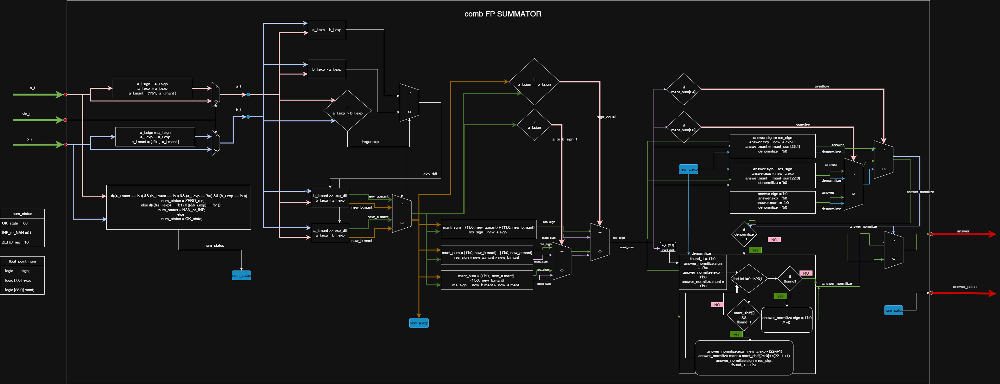

# **comb_fp_summator** — Комбинационный сумматор чисел с плавающей точкой



## **Описание**
Модуль **`comb_fp_summator`** реализует **сложение двух чисел с плавающей точкой** формата **IEEE 754 single-precision (32 бита)** без учета операций округления.
Он принимает на вход два операнда типа **`float_point_num`** и возвращает результат сложения и **статус вычисления**.

В пакете **`float_types_pkg`** определена структура **`float_point_num`** с полями:
- `sign` — **1 бит** (знак числа)
- `exp` — **8 бит** (порядок)
- `mant` — **24 бита** (мантисса, включая скрытый старший бит `1`)

---


## **Интерфейс модуля**

| Сигнал            | Направление | Тип               | Описание            |
|-------------------|-------------|-------------------|---------------------|
| `a_i`             | input       | `float_point_num` | Первый операнд      |
| `b_i`             | input       | `float_point_num` | Второй операнд      |
| `vld_i`           | input       | `logic`           | Сигнал валидности   |
| `answer_o`        | output      | `float_point_num` | Результат сложения  |
| `answer_status_o` | output      | `num_status`      | Статус результата   |

### **Статусы результата (`answer_status_o`)**
- `OK_state` (**00**) — обычный результат
- `NAN_or_INF` (**01**) — один из операндов является **NaN** или **±∞** (экспонента = 255)
- `ZERO_res` (**10**) — результат равен нулю, если оба операнда нулевые.

---
## **Принцип работы**

### **1. Выравнивание экспонент**
- Определяется операнд с **большим порядком**.
- Мантисса числа с **меньшим порядком** сдвигается **вправо** на разность экспонент.
- В результате экспоненты обоих чисел становятся равными.

### **2. Сложение или вычитание мантисс**
- Если **знаки операндов одинаковые** → мантиссы **складываются**.
- Если **знаки разные** → из большей по модулю мантиссы **вычитается меньшая**.
- Знак результата берётся **от числа с большей мантиссой**.

### **3. Нормализация результата**
- Если после сложения возникает **перенос** → мантисса сдвигается **вправо**, а экспонента **увеличивается на 1**.
- Если после вычитания появляются **ведущие нули** → мантисса сдвигается **влево**, а экспонента **уменьшается**.
- Если в процессе нормализации **все биты мантиссы обнулились** → результат равен **0** (`ZERO_res`).

### **4. Установка знака**
- Знак результата выбирается **по большему по модулю операнду**.

 При этом учитывается **скрытый старший бит мантиссы** в соответствии со стандартом **IEEE 754**.

---

## **Тестирование**

В проекте присутствует тестбенч **`tb_fp_adder`**, который проверяет работу сумматора на нескольких примерах:

| Тестовый случай           | Пример                 | Ожидаемый результат         |
|---------------------------|-------------------------|------------------------------|
| Положительные операнды    | `0.875 + 2.2`          | `3.075`                     |
| Сумма единиц             | `1 + 1`                | `2`                         |
| Разноимённые числа        | `2 + (-1)`             | `1`                         |
| Взаимная компенсация      | `5.75 + (-5.75)`       | `0` *(статус `ZERO_res`)*   |
| Нули                      | `0 + 0`                | `0` *(статус `ZERO_res`)*   |

Тестбенч сравнивает поля (`sign`, `exp`, `mant`) результата с ожидаемыми значениями и выводит сообщение о прохождении или провале теста.

---

## **Пример использования**

```systemverilog
import float_types_pkg::*;

// Создание экземпляра сумматора
comb_fp_summator uut (
  .a_i('{sign: 1'b0, exp: 8'b0111_1110, mant: 23'b11000000000000000000000}), // 0.875
  .b_i('{sign: 1'b0, exp: 8'b1000_0000, mant: 23'b00011001100110011001101}), // 2.2
  .vld_i(1'b1),
  .answer_status_o(status),
  .answer_o(sum)
);

// Здесь a_i и b_i задаются как {sign, exp, mant},
// а результат sum имеет такую же структуру.
