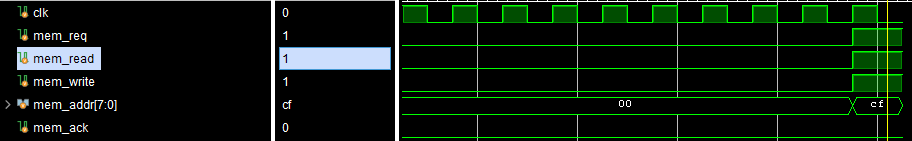

# 01

Нужно просто написать один property, и посмотреть правильно ли работает модуль, вовремя ли выставляет req


а точнее:


то есть он ставит запросы, но иногда не успевает (это подтверждается этим участком кода)

```sv
    initial begin
        request <= 0;
        @(posedge clk);
        forever begin
            while(!ready) @(posedge clk);
            repeat($urandom_range(5, 15)) @(posedge clk);
            request <= 1;
            @(posedge clk);
            request <= 0;
        end
    end
```
тут явно видно, что до 15 тактов простой, хотя максимум может быть 10


# 02

я написал первую версию тб прошел несколько ассертов и наткнулся на

```tcl
Time: 77965 ns Started: 77965 ns Scope: /testbench_02 File: C:/Users/glkru/internship/Internship/10_verif/lesson_7/02_sva/testbench_02.sv Line:107
77965000 Bad testbench_02!
```

```sv
    property pReadWrite;
             @(posedge clk) mem_req |-> !(mem_read && mem_write) throughout mem_req;
    endproperty

    apReadWrite: assert property(pReadWrite) begin
        $display("%0t Good %m!", $time());
    end else begin
        $display("%0t Bad %m!", $time());
        $stop();
    end
```

из времянки видно что при запросе к памяти, чтение и запись выставлены одновременно (и это ошибка тб)



```sv
task automatic read_write(input bit can_interleave = 0);
     bit read, write;
     read = $urandom();
     if( can_interleave ) write = $urandom();
     else write = ~read;
     mem_read  <= read;
     mem_write <= write;
 endtask
```sv

меняем на
```

task automatic read_write(input bit can_interleave = 0);
     bit read, write;
     read = $urandom();
     if( can_interleave ) write = read ? (0) : ($urandom());
     else write = ~read;
     mem_read  <= read;
     mem_write <= write;
 endtask
```


теперь все отлично и все проходит.
