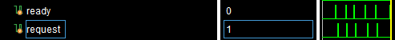
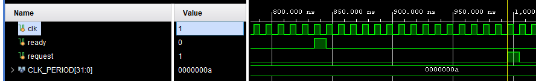

# 01

Нужно просто написать один property, и посмотреть правильно ли работает модуль, вовремя ли выставляет req



а точнее:



то есть он ставит запросы, но иногда не успевает (это подтверждается этим участком кода)

```sv
    initial begin
        request <= 0;
        @(posedge clk);
        forever begin
            while(!ready) @(posedge clk);
            repeat($urandom_range(5, 15)) @(posedge clk);
            request <= 1;
            @(posedge clk);
            request <= 0;
        end
    end
```
тут явно видно, что до 15 тактов простой, хотя максимум может быть 10
