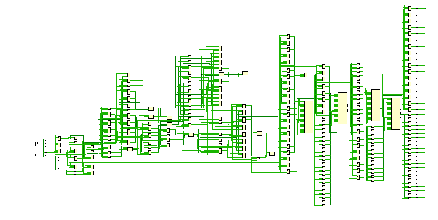

# lab 1 отчет

## 1. Сделайте сравнительный анализ тактовой частоты примера без конвейеризации и примера с конвейеризацией. Какой из примеров быстрее, почему?

схема конвейеризированная



схема комбинаторного


ради интереса попробовал синтез в вивадо и получил максимальный критический путь(без задания ограничений):

### конвейер = 9.259

```rpt
Max Delay Paths
--------------------------------------------------------------------------------------
Slack:                    inf
  Source:                 pow_data_o_OBUF[39]_inst_i_2/C
                            (rising edge-triggered cell FDCE)
  Destination:            pow_data_o[34]
                            (output port)
  Path Group:             (none)
  Path Type:              Max at Slow Process Corner
  Data Path Delay:        9.259ns  (logic 3.499ns (37.792%)  route 5.760ns (62.208%))
  Logic Levels:           3  (FDCE=1 LUT2=1 OBUF=1)
```

получается ориентировочно 108 Мгц

### комб = 23.832

```rpt
Slack:                    inf
  Source:                 pow_input_ff_reg[7]/C
                            (rising edge-triggered cell FDCE)
  Destination:            pow_output_ff_reg[8]/D
  Path Group:             (none)
  Path Type:              Max at Slow Process Corner
  Data Path Delay:        23.832ns  (logic 14.584ns (61.194%)  route 9.248ns (38.806%))
  Logic Levels:           12  (CARRY4=4 DSP48E1=3 FDCE=1 LUT2=1 LUT4=1 LUT6=2)
```
получается ориентировочно 41 Мгц

соответственно разница в скоростях близко к трехкратной, хотя в идеале должна стремится к четырехкратной, т.к. стадий 4

## 2. Добавьте clock gating для регистров с данными в пример исходного кода по ссылке. Напишите тестбенч и убедитесь в том, что дизайн работает корректно после правок.

>объединен с третьим номером

## 3. Уберите лишние ресеты в примере исходного кода по ссылке. Напишите тестбенч и убедитесь в том, что дизайн работает корректно после правок.

до изменения:


```rpt
Max Delay Paths
--------------------------------------------------------------------------------------
Slack:                    inf
  Source:                 pow_data_o_OBUF[39]_inst_i_2/C
                            (rising edge-triggered cell FDCE)
  Destination:            pow_output_ff_reg[7]/D
  Path Group:             (none)
  Path Type:              Max at Slow Process Corner
  Data Path Delay:        7.790ns  (logic 4.421ns (56.754%)  route 3.369ns (43.246%))
  Logic Levels:           3  (DSP48E1=1 FDCE=1 LUT2=1)

  1. Slice Logic
--------------

+-------------------------+------+-------+------------+-----------+-------+
|        Site Type        | Used | Fixed | Prohibited | Available | Util% |
+-------------------------+------+-------+------------+-----------+-------+
| Slice LUTs*             |  122 |     0 |          0 |     63400 |  0.19 |
|   LUT as Logic          |  122 |     0 |          0 |     63400 |  0.19 |
|   LUT as Memory         |    0 |     0 |          0 |     19000 |  0.00 |
| Slice Registers         |   69 |     0 |          0 |    126800 |  0.05 |
|   Register as Flip Flop |   69 |     0 |          0 |    126800 |  0.05 |
|   Register as Latch     |    0 |     0 |          0 |    126800 |  0.00 |
| F7 Muxes                |    0 |     0 |          0 |     31700 |  0.00 |
| F8 Muxes                |    0 |     0 |          0 |     15850 |  0.00 |
+-------------------------+------+-------+------------+-----------+-------+
```
после изменения:

```rpt
1. Slice Logic
--------------

+-------------------------+------+-------+------------+-----------+-------+
|        Site Type        | Used | Fixed | Prohibited | Available | Util% |
+-------------------------+------+-------+------------+-----------+-------+
| Slice LUTs              |   53 |     0 |          0 |     63400 |  0.08 |
|   LUT as Logic          |   53 |     0 |          0 |     63400 |  0.08 |
|   LUT as Memory         |    0 |     0 |          0 |     19000 |  0.00 |
| Slice Registers         |   38 |     0 |          0 |    126800 |  0.03 |
|   Register as Flip Flop |   38 |     0 |          0 |    126800 |  0.03 |
|   Register as Latch     |    0 |     0 |          0 |    126800 |  0.00 |
| F7 Muxes                |    0 |     0 |          0 |     31700 |  0.00 |
| F8 Muxes                |    0 |     0 |          0 |     15850 |  0.00 |
+-------------------------+------+-------+------------+-----------+-------+
Max Delay Paths
--------------------------------------------------------------------------------------
Slack:                    inf
  Source:                 pow_input_ff_reg[0]/C
                            (rising edge-triggered cell FDRE)
  Destination:            pow_data_stage_2_ff_reg/A[15]
  Path Group:             (none)
  Path Type:              Max at Slow Process Corner
  Data Path Delay:        7.748ns  (logic 2.819ns (36.385%)  route 4.929ns (63.615%))
  Logic Levels:           9  (CARRY4=4 FDRE=1 LUT4=1 LUT6=3)
```
