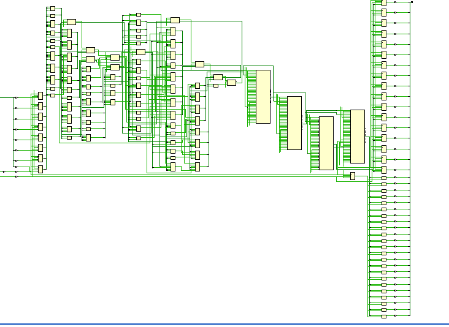

# lab 1 отчет

## 1. Сделайте сравнительный анализ тактовой частоты примера без конвейеризации и примера с конвейеризацией. Какой из примеров быстрее, почему?

схема конвейеризированная


схема комбинаторного




ради интереса попробовал синтез в вивадо и получил максимальный критический путь(без задания ограничений):

### конвейер = 9.259

```rpt
Max Delay Paths
--------------------------------------------------------------------------------------
Slack:                    inf
  Source:                 pow_data_o_OBUF[39]_inst_i_2/C
                            (rising edge-triggered cell FDCE)
  Destination:            pow_data_o[34]
                            (output port)
  Path Group:             (none)
  Path Type:              Max at Slow Process Corner
  Data Path Delay:        9.259ns  (logic 3.499ns (37.792%)  route 5.760ns (62.208%))
  Logic Levels:           3  (FDCE=1 LUT2=1 OBUF=1)
```

получается ориентировочно 108 Мгц

энергопотребление:


### комб = 23.832

```rpt
Slack:                    inf
  Source:                 pow_input_ff_reg[7]/C
                            (rising edge-triggered cell FDCE)
  Destination:            pow_output_ff_reg[8]/D
  Path Group:             (none)
  Path Type:              Max at Slow Process Corner
  Data Path Delay:        23.832ns  (logic 14.584ns (61.194%)  route 9.248ns (38.806%))
  Logic Levels:           12  (CARRY4=4 DSP48E1=3 FDCE=1 LUT2=1 LUT4=1 LUT6=2)
```
получается ориентировочно 41 Мгц

энергопотребление:


